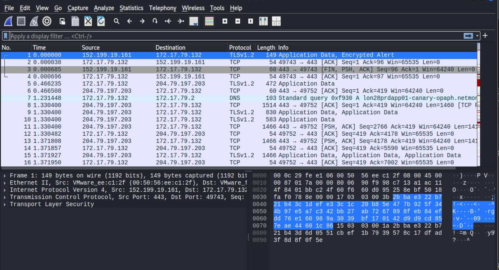
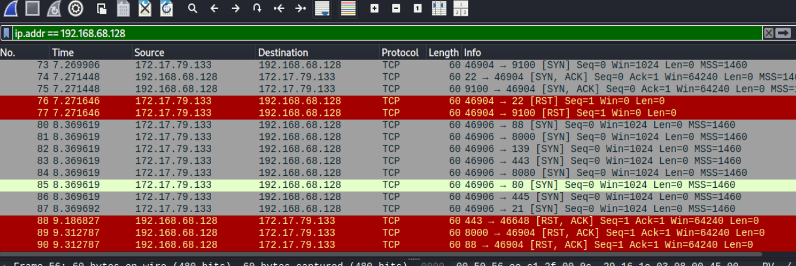
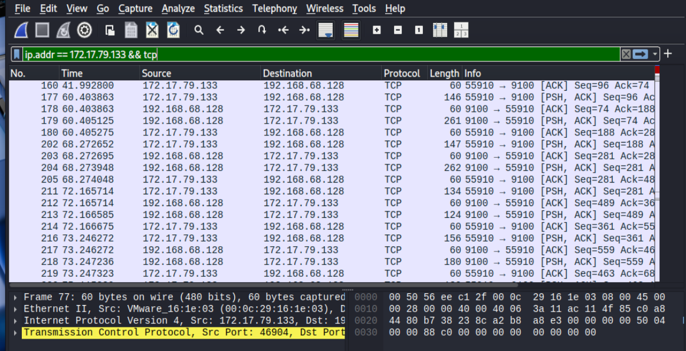
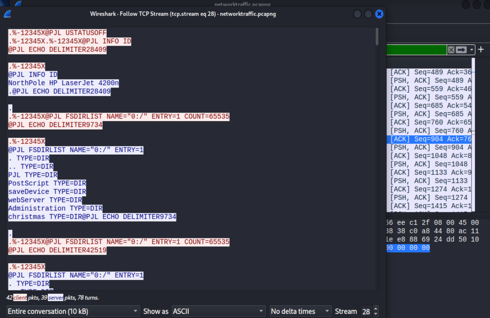
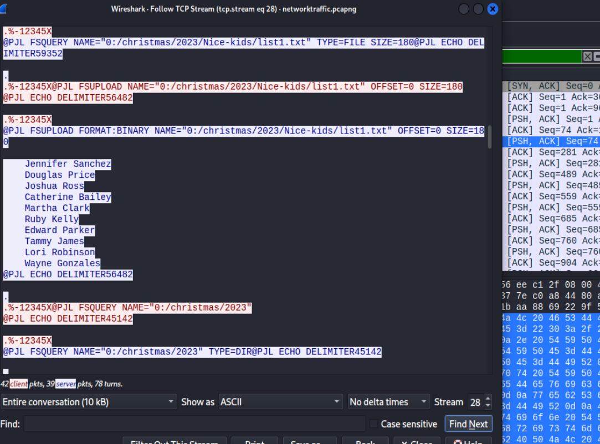
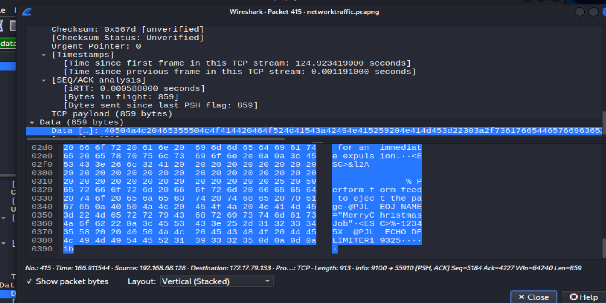
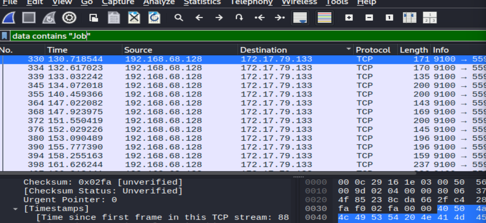
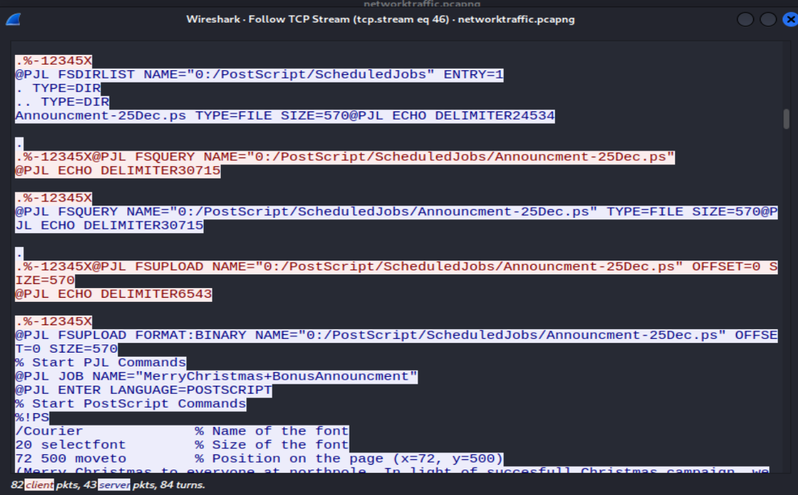
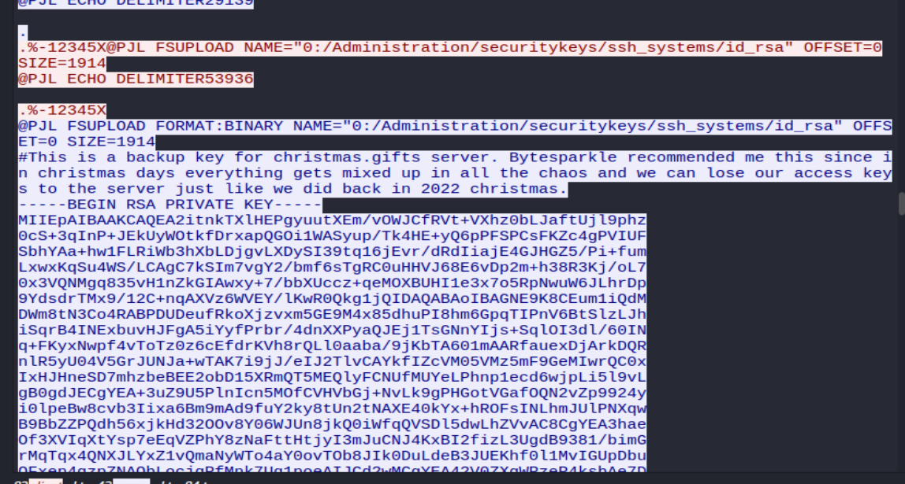
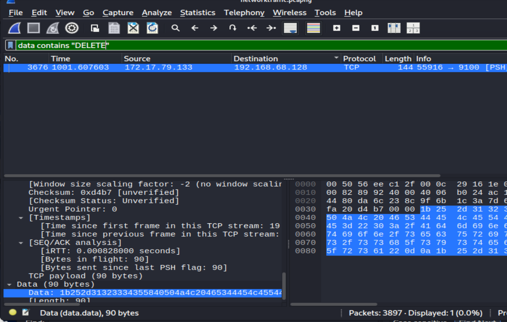

## 题目简介
打印机在圣诞老人的工作室中很重要，但我们还没有真正尝试确保它们的安全！格林奇和他的精英黑客团队可能会试图利用它来对付我们！请使用提供的数据包捕获进行调查！打印机服务器 IP 地址为 192.168.68.128 请注意 - 这些 Sherlocks 是按顺序完成的！

附件信息
```zsh
┌──(wackymaker㉿kali)-[~/tmp/sherlock/OpTinselTrace-4]
└─$ dir
networktraffic.pcapng  networktraffic.zip  optinseltrace4.zip
```
只有一个流量包
## 攻击ip地址为？
题目原文（网络打印机服务器的性能变得缓慢，导致北极车间的工作流程中断。圣诞老人指示我们生成支持请求并检查网络数据以查明问题的根源。他怀疑格林奇和他的团队可能参与了这种情况。您能否验证是否有向打印机服务器发送过多流量的 IP 地址？）

打开文件包，一共3800多个包



提供给了我们打印机的ip地址，只需要过滤出打印机ip就能找到请求最多的ip



答案：172.17.79.133

## 最终攻击端口
题目原文（Bytesparkle 作为技术负责人，发现了来自先前攻击中识别的同一 IP 的端口扫描痕迹。然后，哪个端口是打印机最初入侵的目标？）

过滤攻击ip，并锁定初步攻击时的流量包，我们能找到攻击者对9100端口进行了大量访问



答案；9100

## 服务器上运行的打印机的全名是什么？
随便找几个9100的包追踪tcp，我们能找到如下文本



答案： Northpole HP LaserJet 4200n

## 格林奇截获了一份圣诞老人制作的善良和顽皮孩子的名单。好名单上的第二个孩子叫什么名字？

并不太理解打印机流量数据中的内容，于是我继续分析刚才追踪的tcp，找到了类似名单的东西



```zsh
@PJL FSUPLOAD FORMAT:BINARY NAME="0:/christmas/2023/Nice-kids/list1.txt" OFFSET=0 SIZE=180

    Jennifer Sanchez
    Douglas Price
    Joshua Ross
    Catherine Bailey
    Martha Clark
    Ruby Kelly
    Edward Parker
    Tammy James
    Lori Robinson
    Wayne Gonzales
@PJL ECHO DELIMITER56482
```
答案：Douglas Price

## 查看圣诞老人种植elfin雇佣关系的理由

题目原文（格林奇获得了一份打印作业指令文件，该文件用于一位名叫埃尔芬的员工使用的打印机。看来圣诞老人和北极管理团队已经做出了解雇 Elfin 的决定。您能否提供终止 Elfin 雇佣关系的决定背后的逐字理由？）

我们过滤data字段，查找和这个id有关的包

```zsh
data contains "Elfin"
```



只有415这个包出现了ascii码的Elfin，那就无需追踪流了

简单看了一下答案是因为这人是个二五仔

答案：The addressed employee is confirmed to be working with grinch and team. According to Clause 69 , This calls for an immediate expulsion.

## 计划打印作业的名称是什么？
过滤Job,我们能找到大约几十个流量包



随便点一个追踪流，可惜都是打印机的打印任务，找不到有用的，但是我意识到计划任务应该会有start关键词

```zsh
data contains "Start"
```

只有一个数据包，但是当中存在我们需要的内容



答案：MerryChristmas+BonusAnnouncment

## ssh利用方式？
题目（在我们对当前数据包捕获的持续分析中，情况已经惊人地升级。我们的安全系统在一台高度关键的服务器上检测到了漏洞利用后活动的迹象，该服务器本应通过仅使用 SSH 密钥进行安全访问。这一事态发展引起了安全团队的严重担忧。在 Bytesparkle 调查此次违规行为时，他推测此次安全事件可能与早期的打印机问题有关。您能否确定并提供打印机服务器上使格林奇能够横向移动到此关键服务器的文件的完整路径？）

看来关键在于ssh

过滤后发现与上一题tcp流一致，都在46流



明显的ssh私钥

答案：/Administration/securitykeys/ssh_systems/id_rsa

## 私钥字节大小

在上图私钥信息中就出现了

答案：1914

## 泄露的另一台主机

与上题一致的泄露区域，有一则注释

```zsh
#This is a backup key for christmas.gifts server. Bytesparkle recommended me this since in christmas days everything gets mixed up in all the chaos and we can lose our access keys to the server just like we did back in 2022 christmas.
```

答案：christmas.gifts

## 格林奇什么时候试图从打印机中删除文件？（UTC）

这道题我找了很久，并不在28或者46流，当过来吧DELETE后我们找到了结果



数据包3676存在delete关键字

答案：2023-12-08 12:18:14