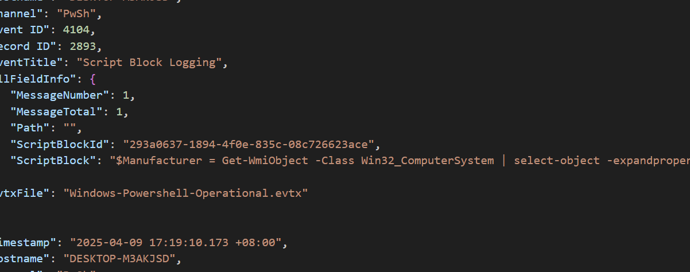
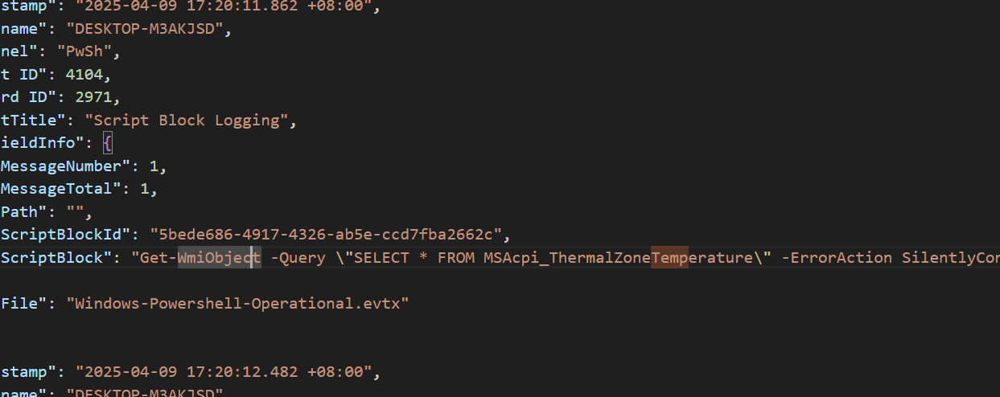
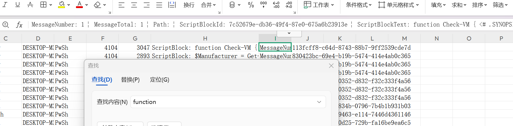
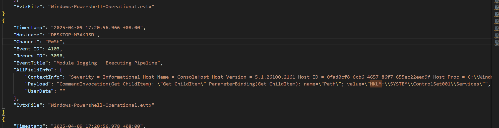
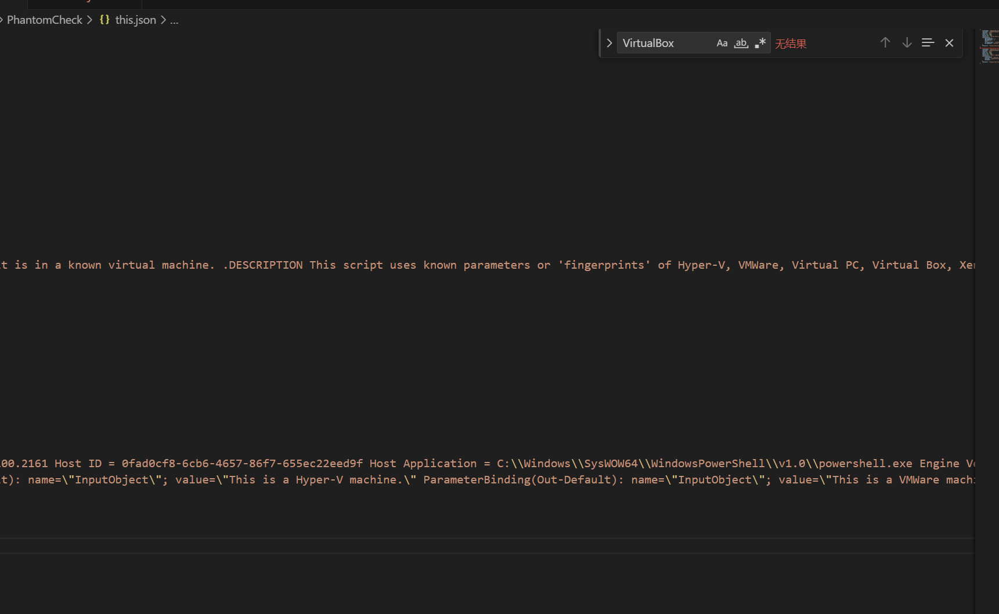

## 题目简介与题目附件
Talion 怀疑威胁行为者进行了反虚拟化检查，以避免在沙盒环境中被检测到。您的任务是分析事件日志并确定用于虚拟化检测的特定技术。Byte Doctor 需要攻击者执行这些检查的注册表检查或进程的证据。

附件提供如下
```zsh
 C:\Users\wacky\Desktop\sherlock\PhantomCheck 的目录

2025/08/28  15:11    <DIR>          .
2025/08/28  15:11    <DIR>          ..
2025/04/09  17:24         1,118,208 Microsoft-Windows-Powershell.evtx
2025/04/09  17:24        15,798,272 Windows-Powershell-Operational.evtx
```
## Task1
攻击者使用哪个 WMI 类来检索模型和制造商信息以进行虚拟化检测？

wmi类全称（Windows Management Instrumentation Class）是windows管理规范框架中的一种对象定义，它用来表述管理windows中的系统资源，而这种管理接口一般是通过powrshell调用的所以我们将目光转向powershell

这里使用隼鸟过滤出powershell事件中所有关于Wmi的事件记录
```zsh
C:\Users\wacky\Desktop\sherlock\PhantomCheck>hayabusa search -f Windows-Powershell-Operational.evtx -k "Wmi" -J -o "Wmi.json"

┏┓ ┏┳━━━┳┓  ┏┳━━━┳━━┓┏┓ ┏┳━━━┳━━━┓
┃┃ ┃┃┏━┓┃┗┓┏┛┃┏━┓┃┏┓┃┃┃ ┃┃┏━┓┃┏━┓┃
┃┗━┛┃┃ ┃┣┓┗┛┏┫┃ ┃┃┗┛┗┫┃ ┃┃┗━━┫┃ ┃┃
┃┏━┓┃┗━┛┃┗┓┏┛┃┗━┛┃┏━┓┃┃ ┃┣━━┓┃┗━┛┃
┃┃ ┃┃┏━┓┃ ┃┃ ┃┏━┓┃┗━┛┃┗━┛┃┗━┛┃┏━┓┃
┗┛ ┗┻┛ ┗┛ ┗┛ ┗┛ ┗┻━━━┻━━━┻━━━┻┛ ┗┛
   by Yamato Security

Getting 80% of the work done in 20% of the time~

Searching...

Start time: 2025/08/28 15:26
Total event log files: 1
Total file size: 15.1 MiB

Currently searching. Please wait.

[00:00:00] 1 / 1   [========================================] 100%

Scanning finished.
                                                                                                                        Total findings: 6
Saved results: Wmi.json (5.2 KiB)

Elapsed time: 00:00:00.044

初心忘るべからず - Shoshin Wasuru Bekarazu - Never forget the beginner's mind.
```
得到的结果不多，就直接看即可



可以看到调用了Win32_ComputerSystem

答案：Win32_ComputerSystem

## Task2
攻击者是用哪条 WMI 命令查当前机器温度的？

比较典型的绕沙箱策略，检测实体机的硬件温度进行判断

在刚才调用wmi的查询当中，我们能检索Temperature找到目标



答案：SELECT * FROM MSAcpi_ThermalZoneTemperature

## Task3
攻击者加载了powershell脚本来检测虚拟化，脚本函数是什么？

我本来是想过滤Import-Module用来查找加载模块的行为，但是并没有好效果，所以我打算将powershell事件日志转换为时间线输出

```zsh
C:\Users\wacky\Desktop\sherlock\PhantomCheck>hayabusa csv-timeline -f Windows-Powershell-Operational.evtx -o time_powershell.csv

┏┓ ┏┳━━━┳┓  ┏┳━━━┳━━┓┏┓ ┏┳━━━┳━━━┓
┃┃ ┃┃┏━┓┃┗┓┏┛┃┏━┓┃┏┓┃┃┃ ┃┃┏━┓┃┏━┓┃
┃┗━┛┃┃ ┃┣┓┗┛┏┫┃ ┃┃┗┛┗┫┃ ┃┃┗━━┫┃ ┃┃
┃┏━┓┃┗━┛┃┗┓┏┛┃┗━┛┃┏━┓┃┃ ┃┣━━┓┃┗━┛┃
┃┃ ┃┃┏━┓┃ ┃┃ ┃┏━┓┃┗━┛┃┗━┛┃┗━┛┃┏━┓┃
┗┛ ┗┻┛ ┗┛ ┗┛ ┗┛ ┗┻━━━┻━━━┻━━━┻┛ ┗┛
   by Yamato Security

Taking threat detection to the next level~

Start time: 2025/08/28 15:36
Total event log files: 1
Total file size: 15.1 MiB

Scan wizard:
✔ Which set of detection rules would you like to load? · 5. All event and alert rules (4,701 rules) ( status: * | level: informational+ )
✔ Include deprecated rules? (219 rules) · yes
✔ Include unsupported rules? (42 rules) · yes
✔ Include noisy rules? (12 rules) · yes
✔ Include sysmon rules? (2,305 rules) · yes
```
在生成所有规则过滤后，我们筛选出function



多找一找就找到了

答案：Check-VM

## Task4
述脚本查询了哪个注册表项来检索服务详细信息以进行虚拟化检测？

查询注册表的话，我们先直接从原时间过滤出注册表相关信息
```zsh
hayabusa search -f Windows-Powershell-Operational.evtx -k "HKLM" -J -o "HKLM.json"
```
筛选后获得



答案：HKLM:\SYSTEM\ControlSet001\Services

## Task5
检测脚本也可以识别 VirtualBox。它比较哪些进程以确定系统是否正在运行 VirtualBox？

还是在task3筛选出来的事件中能看到日志
```zsh
ScriptBlock: function Check-VM { <# .SYNOPSIS Nishang script which detects whether it is in a known virtual machine. .DESCRIPTION This script uses known parameters or 'fingerprints' of Hyper-V, VMWare, Virtual PC, Virtual Box, Xen and QEMU for detecting the environment. .EXAMPLE PS > Check-VM .LINK http://www.labofapenetrationtester.com/2013/01/quick-post-check-if-your-payload-is.html https://github.com/samratashok/nishang .NOTES The script draws heavily from checkvm.rb post module from msf. https://github.com/rapid7/metasploit-framework/blob/master/modules/post/windows/gather/checkvm.rb #> [CmdletBinding()] Param() $ErrorActionPreference = "SilentlyContinue" #Hyper-V $hyperv = Get-ChildItem HKLM:\SOFTWARE\Microsoft if (($hyperv -match "Hyper-V") -or ($hyperv -match "VirtualMachine")) { $hypervm = $true } if (!$hypervm) { $hyperv = Get-ItemProperty hklm:\HARDWARE\DESCRIPTION\System -Name SystemBiosVersion if ($hyperv -match "vrtual") { $hypervm = $true } } if (!$hypervm) { $hyperv = Get-ChildItem HKLM:\HARDWARE\ACPI\FADT if ($hyperv -match "vrtual") { $hypervm = $true } } if (!$hypervm) { $hyperv = Get-ChildItem HKLM:\HARDWARE\ACPI\RSDT if ($hyperv -match "vrtual") { $hypervm = $true } } if (!$hypervm) { $hyperv = Get-ChildItem HKLM:\SYSTEM\ControlSet001\Services if (($hyperv -match "vmicheartbeat") -or ($hyperv -match "vmicvss") -or ($hyperv -match "vmicshutdown") -or ($hyperv -match "vmiexchange")) { $hypervm = $true } } if ($hypervm) { "This is a Hyper-V machine." } #VMWARE $vmware = Get-ChildItem HKLM:\SYSTEM\ControlSet001\Services if (($vmware -match "vmdebug") -or ($vmware -match "vmmouse") -or ($vmware -match "VMTools") -or ($vmware -match "VMMEMCTL")) { $vmwarevm = $true } if (!$vmwarevm) { $vmware = Get-ItemProperty hklm:\HARDWARE\DESCRIPTION\System\BIOS -Name SystemManufacturer if ($vmware -match "vmware") { $vmwarevm = $true } } if (!$vmwarevm) { $vmware = Get-Childitem hklm:\hardware\devicemap\scsi -recurse | gp -Name identifier if ($vmware -match "vmware") { $vmwarevm = $true } } if (!$vmwarevm) { $vmware = Get-Process if (($vmware -eq "vmwareuser.exe") -or ($vmware -match "vmwaretray.exe")) { $vmwarevm = $true } } if ($vmwarevm) { "This is a VMWare machine." } #Virtual PC $vpc = Get-Process if (($vpc -eq "vmusrvc.exe") -or ($vpc -match "vmsrvc.exe")) { $vpcvm = $true } if (!$vpcvm) { $vpc = Get-Process if (($vpc -eq "vmwareuser.exe") -or ($vpc -match "vmwaretray.exe")) { $vpcvm = $true } } if (!$vpcvm) { $vpc = Get-ChildItem HKLM:\SYSTEM\ControlSet001\Services if (($vpc -match "vpc-s3") -or ($vpc -match "vpcuhub") -or ($vpc -match "msvmmouf")) { $vpcvm = $true } } if ($vpcvm) { "This is a Virtual PC." } #Virtual Box $vb = Get-Process if (($vb -eq "vboxservice.exe") -or ($vb -match "vboxtray.exe")) { $vbvm = $true } if (!$vbvm) { $vb = Get-ChildItem HKLM:\HARDWARE\ACPI\FADT if ($vb -match "vbox_") { $vbvm = $true } } if (!$vbvm) { $vb = Get-ChildItem HKLM:\HARDWARE\ACPI\RSDT if ($vb -match "vbox_") { $vbvm = $true } } if (!$vbvm) { $vb = Get-Childitem hklm:\hardware\devicemap\scsi -recurse | gp -Name identifier if ($vb -match "vbox") { $vbvm = $true } } if (!$vbvm) { $vb = Get-ItemProperty hklm:\HARDWARE\DESCRIPTION\System -Name SystemBiosVersion if ($vb -match "vbox") { $vbvm = $true } } if (!$vbvm) { $vb = Get-ChildItem HKLM:\SYSTEM\ControlSet001\Services if (($vb -match "VBoxMouse") -or ($vb -match "VBoxGuest") -or ($vb -match "VBoxService") -or ($vb -match "VBoxSF")) { $vbvm = $true } } if ($vbvm) { "This is a Virtual Box." } #Xen $xen = Get-Process if ($xen -eq "xenservice.exe") { $xenvm = $true } if (!$xenvm) { $xen = Get-ChildItem HKLM:\HARDWARE\ACPI\FADT if ($xen -match "xen") { $xenvm = $true } } if (!$xenvm) { $xen = Get-ChildItem HKLM:\HARDWARE\ACPI\DSDT if ($xen -match "xen") { $xenvm = $true } } if (!$xenvm) { $xen = Get-ChildItem HKLM:\HARDWARE\ACPI\RSDT if ($xen -match "xen") { $xenvm = $true } } if (!$xenvm) { $xen = Get-ChildItem HKLM:\SYSTEM\ControlSet001\Services if (($xen -match "xenevtchn") -or ($xen -match "xennet") -or ($xen -match "xennet6") -or ($xen -match "xensvc") -or ($xen -match "xenvdb")) { $xenvm = $true } } if ($xenvm) { "This is a Xen Machine." } #QEMU $qemu = Get-Childitem hklm:\hardware\devicemap\scsi -recurse | gp -Name identifier if ($qemu -match "qemu") { $qemuvm = $true } if (!$qemuvm) { $qemu = Get-ItemProperty hklm:HARDWARE\DESCRIPTION\System\CentralProcessor\0 -Name ProcessorNameString if ($qemu -match "qemu") { $qemuvm = $true } } if ($qemuvm) { "This is a Qemu machine." } }
```
注释指明了检测逻辑

答案：vboxservice.exe, vboxtray.exe
## Task6
VM 检测脚本打印前缀为“This is a”的任何检测。脚本检测到哪两个虚拟化平台？

一样的过滤关键词
```zsh
hayabusa search -f Windows-Powershell-Operational.evtx -k "This is a" -J -o "this.json"
```



答案：Hyper-V, Vmware