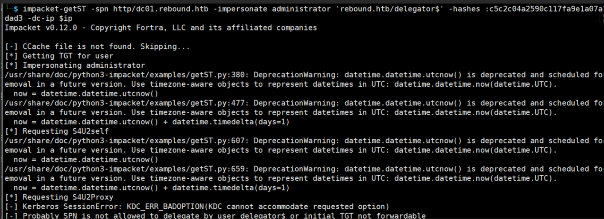
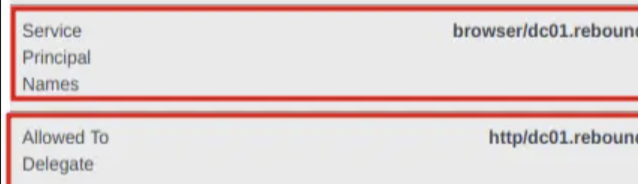
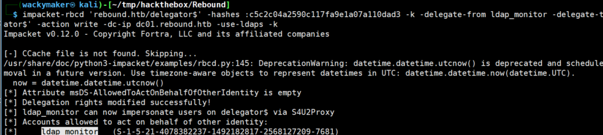
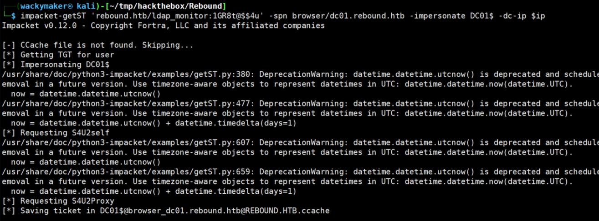
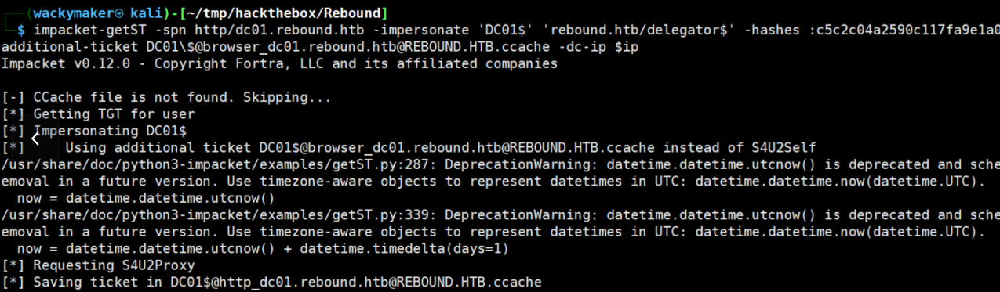
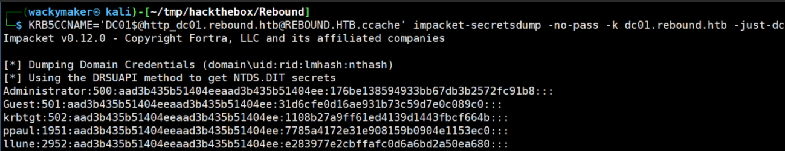

要理解不可转发约束委派为何是难以被攻击的，我们需要了解约束委派本身
## 约束委派简介
简单来说，约束委派是域内的一种机制：允许某个账号（如sever1$)，以其他用户的身份访问特定服务（如 HTTP/dc01.corp.local）。

被允许访问的服务通过 AD 属性 msDS-AllowedToDelegateTo 控制

为了实现这种效果，它用到两个kerberos扩展，分别是S4U2Self以及S4U2Proxy，并且S4U2Self存在一个拓展机制也就是所谓的Protocol Transition（协议转换），正常来说我们遇到的约束委派是默认开启了协议转换的，当我们请求S4U2Self的时候kdc会返回一个代表目标用户的票据，但是是否允许我们利用此票据去请求对应的st，则是协议转换决定的，准确来说是取决于这个票据是否有 forwardable 属性，一旦该票据开启此属性，我们就可以很愉快的使用约束委派的常用打法，直接请求一个管理员的st用来访问对应服务，或者是进行impacket包的攻击。

不过这次我们遇到的是不可转发约束委派
## 实验环境
要完成这种攻击两个特殊的前提，1是具有约束委派的用户需要是机器用户，2是这个机器用户注册了自己的服务（实际上机器用户在创建时就会存在spn，所以是个默认情况），这两个条件缺一不可，可以简单的理解为，既然不允许我们委派任意用户，不如我们直接先变成任意用户之后再去委派。

练习靶机的时候htb的Rebound很好的模拟了这一特殊环境，所以我会直接利用它来进行说明，而事实上我也是从它这里学到可以这么做的。

实验环境如下 IP：10.129.194.21；FQDN：DC01.rebound.htb；具有委派的用户信息：delegator$/c5c2c04a2590c117fa9e1a07a110dad3，和一个普通域用户：ldap_monitor/1GR8t@$$4u

使用工具如下：impacket包

在开始攻击之前，可以通过下面看到delegator$确实配置了约束委派

但是当我们直接请求管理员的时候会报错

其中报错点明了Probably SPN is not allowed to delegate by user delegator$ or initial TGT not forwardable，也就是tgt可能不存在forwardable所以不允许转发票据

这时如果我们抓取猎犬如果看到了这个机器用户存在注册服务，就像这样

我们就可以尝试利用手动构造rbcd（基于资源委派）来强制以任意用户访问delegator$这个机器账户，因为不存在forwardable这个属性只是不允许我们以任意用户请求，并不是不允许请求，所以只要我们提前以及做到了任意用户的身份认证搞到了一张可转发tgs，我们就可以利用这个约束委派去访问目标服务
## 实际操作
具体做法如下

首先将delegator$msDS-AllowedToActOnBehalfOfOtherIdentity属性写入ldap_monitor，将其拥有对delegator$打rbcd的权限，其实也就是为了提前一步伪造为任意用户

利用这层身份，我们可以ldap_monitor以任意身份请求delegator$注册的服务，这里我们直接以dc的机器用户请求

现在我们以及完成了提前一步伪造为我们需要的用户，接下来我们就能直接拿着这张票据去请求约束委派

而这张票据就是我们成功以dc01$的身份在没有开启协议转换的情况下请求了约束委派的服务

而我们可以利用它去打dcsync，其结果证明了我们的成功

可以这么简单的理解约束委派利用的两个机制，我简写为ss和sp,ss用于请求一个tgs（sp用于将这个tgs请求st，但是这里如果开了不可转发的话ss流程获取的tgs就没法用st转发，这时我们构造的环境其实是绕过ss，通过构造rbcd获取了一个tgs，这个tgs由于没有经过ss所以是可以转发的，也就可以利用sp利用
## 小解答
这里简单的解决两个可能会导致疑惑的问题
一：为什么必须 browser 是 delegator$ 注册的 SPN？

这是因为TGS 票据是针对特定服务 SPN 的，KDC 在处理 S4U2Proxy 请求时，会检查：TGS 的服务是否等于你（delegator$）账号注册的服务；如果不匹配，就无法用该 TGS 请求进一步的 ST。所以必须构造
一个 delegator$ 能“合法代理”的票据，也就是它自己注册的服务 SPN，如 browser/dc01.rebound.htb。

二：为什么 ldap_monitor 能获取伪造票据？

因为我们手动将 ldap_monitor 加入到 delegator$ 对象的 msDS-AllowedToActOnBehalfOfOtherIdentity 中，KDC 会允许 ldap_monitor 代表任意用户（如 DC01$）请求对 delegator$ 注册的服务（browser）的票据。这也是rbcd（基于资源委派）的基础打法

三：为什么我们以及拥有了browser的身份为dc01的st，还需要利用http服务？

拿到 browser 的票据只是“中间的跳板”，我们必须借助 delegator$ 的约束委派配置，把这个伪造的身份票据变成能访问目标服务（http）的 ST，才能完成最终攻击。

