这两天写了两篇文章一篇adcs的恶意模板发布还有shadowslnk利用，但这两篇文章我需要去先知赚点稿费，所以先等他们过审了才能传到这边。今天做个情报分析就差不多了。
## 题目简介
在 ICS 行业，您的安全团队始终需要保持最新状态，并且应该了解针对您所在行业组织的威胁。您刚开始担任威胁情报实习生，具有一些 SOC 经验。您的经理给了您一项任务，以测试您的研究技能以及您如何利用 Mitre Att&ck 来发挥自己的优势。对 Sandworm Team（也称为 BlackEnergy Group 和 APT44）进行研究。利用 Mitre ATT&CK 了解如何以可作的形式映射对手的行为和战术。粉碎评估并给您的经理留下深刻印象，因为威胁情报是您的热情所在。

## task1
根据 Mitre 援引的消息来源，沙虫团队是哪一年开始行动的？

打开矩阵，我们能搜索Sandworm Team，我们可以看到这是一个来自俄罗斯的军事组织，最早行动于2009年

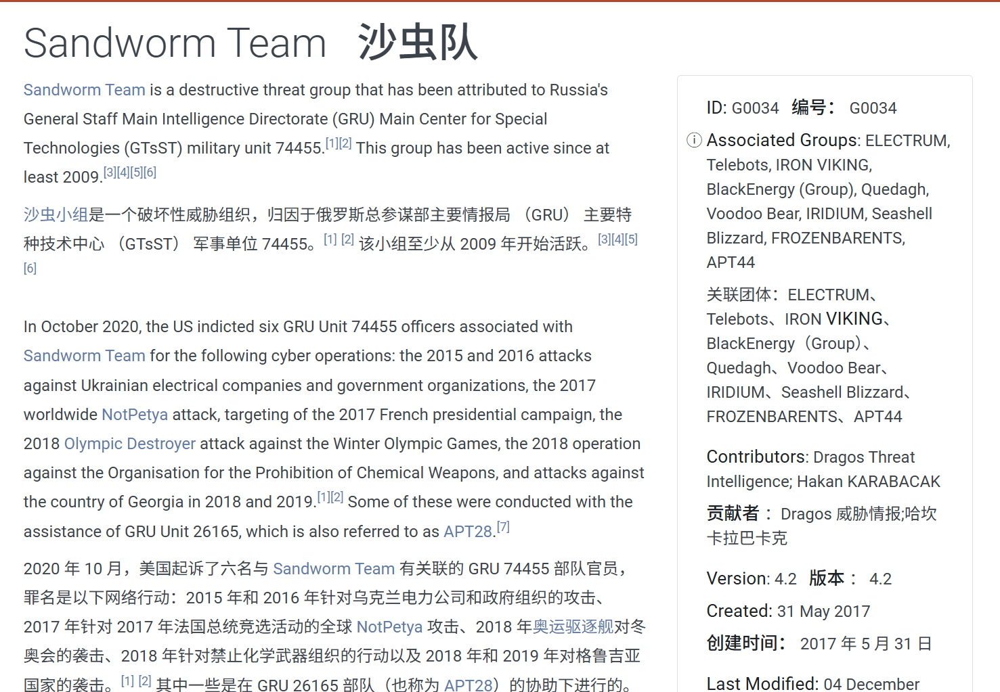

答案：2009

## task2
Mitre 指出，在 2016 年针对乌克兰电网的一次运动中，BlackEnergy 集团使用了两种凭证访问技术来访问受感染网络中的多个主机。一种是 LSASS 内存访问 （T1003.001）。另一个的攻击 ID 是什么？

转到此组织2016针对乌克兰电力系统的攻击，进入矩阵

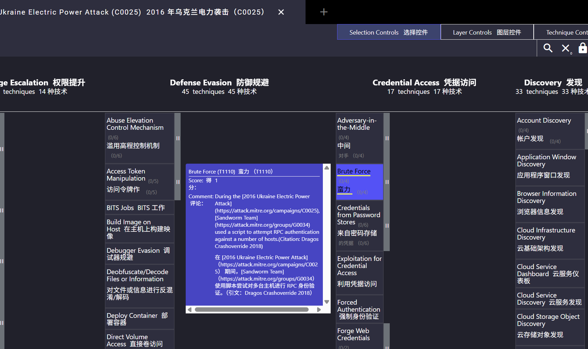

可以看到使用的是暴力破解，也就是T1110

答案：T1110

## task3
在 2016 年的活动中，观察到对手在行动中使用了 VBS 脚本。VBS 文件的名称是什么？

不用进入矩阵，直接在2016行动全局搜索vbs

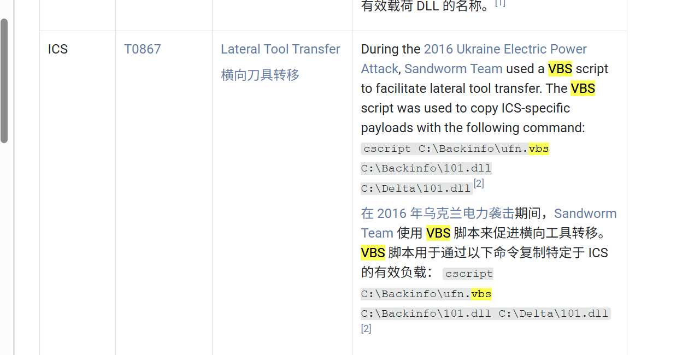

答案：ufn.vbs

## task4
APT 在 2022 年开展了一场重大运动。服务器应用程序被滥用以保持持久性。该组使用持久性技术允许他们进行远程访问的 Mitre Att&ck ID 是什么？

转到2022的攻击记录，发现还是乌克兰的电力系统，这俄罗斯去乌克兰系统和回家没什么区别

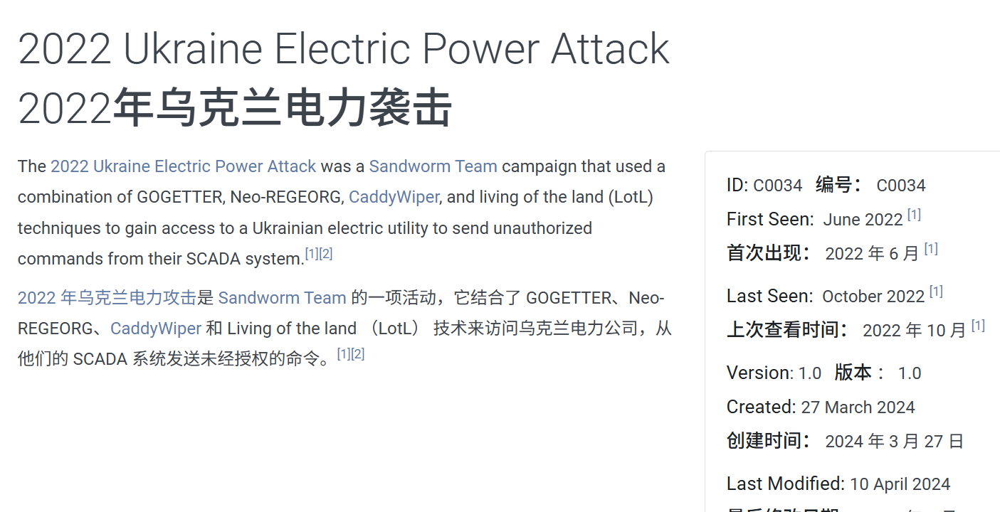

不用进入矩阵，可以直接看到是利用webshell进行权限维持的

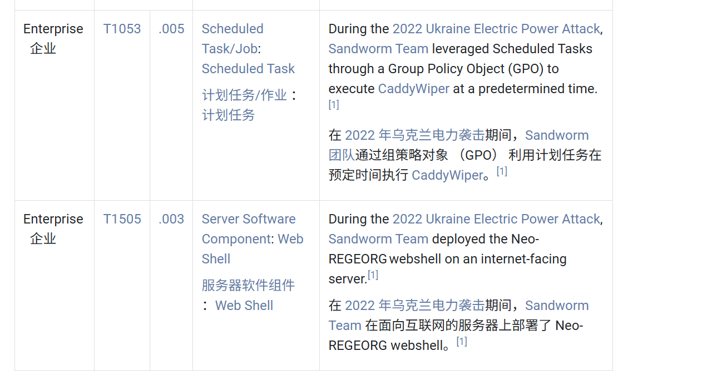

答案：T1505.003

## task5
问题 4 中使用的恶意软件/工具的名称是什么？

截图已经把他显示出来了

答案：Neo-REGEORG

## task6
在 2022 年的同一活动中，该组织滥用了哪个 SCADA 应用程序二进制文件来在 SCADA Systems 上实现代码执行？

往下找我们能找到

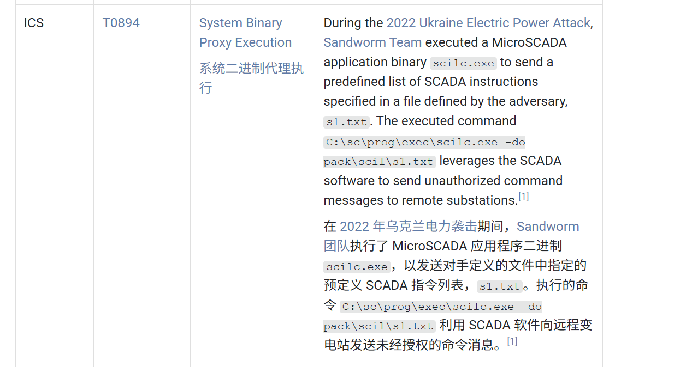

答案：scilc.exe

## task7
确定与问题 6 中执行工具相关的完整命令行，以对 SCADA 环境中的变电站执行作。

路径已经在上面的截图出现了

答案：C:\sc\prog\exec\scilc.exe -do pack\scil\s1.txt

## task8
在同一活动期间，使用什么恶意软件/工具在受感染的环境中进行数据销毁？

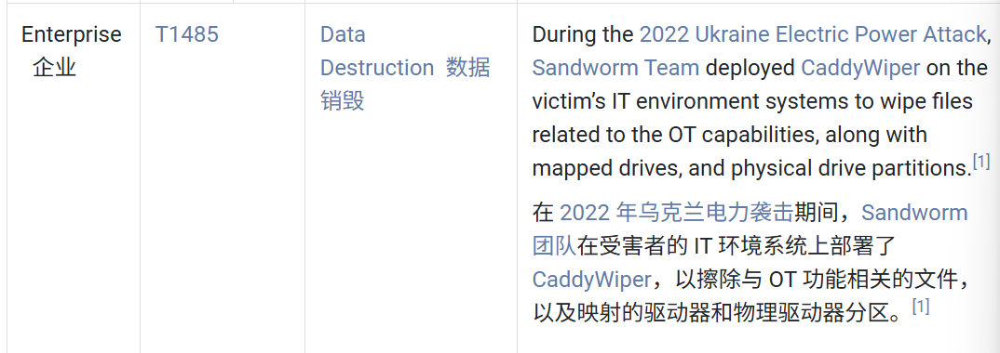

[这篇文章](https://www.ibm.com/think/x-force/caddywiper-malware-targeting-ukrainian-organizations)详细解释了此破坏性工具，还是挺有意思的，利用null直接进行文件覆盖，并设计了域控相关的操作链接

答案：CaddyWiper

## task9
问题 8 中确定的恶意软件/工具还具有其他功能。它可以在执行策略中执行的特定技术的 Mitre Att&ck ID 是什么？

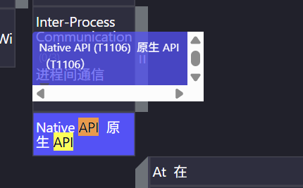

上篇提到的文章讲述了它的攻击都是基于windows原生api，通过SeTakeOwnershipPrivilege它可以夺取程序的进程来绕过文件进程保护

答案：T1106

## task10
众所周知，Sandworm 团队在他们的活动中使用不同的工具。它们与自动传播的恶意软件相关联，该恶意软件充当勒索软件，同时具有类似蠕虫的功能 .这个恶意软件的名称是什么？

回到此apt主页，检索其使用工具

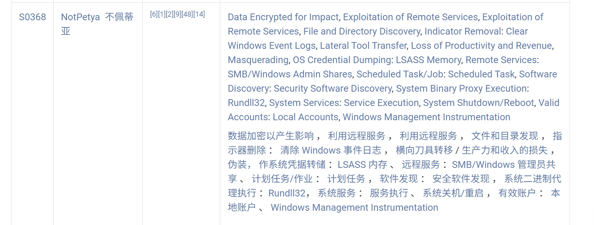

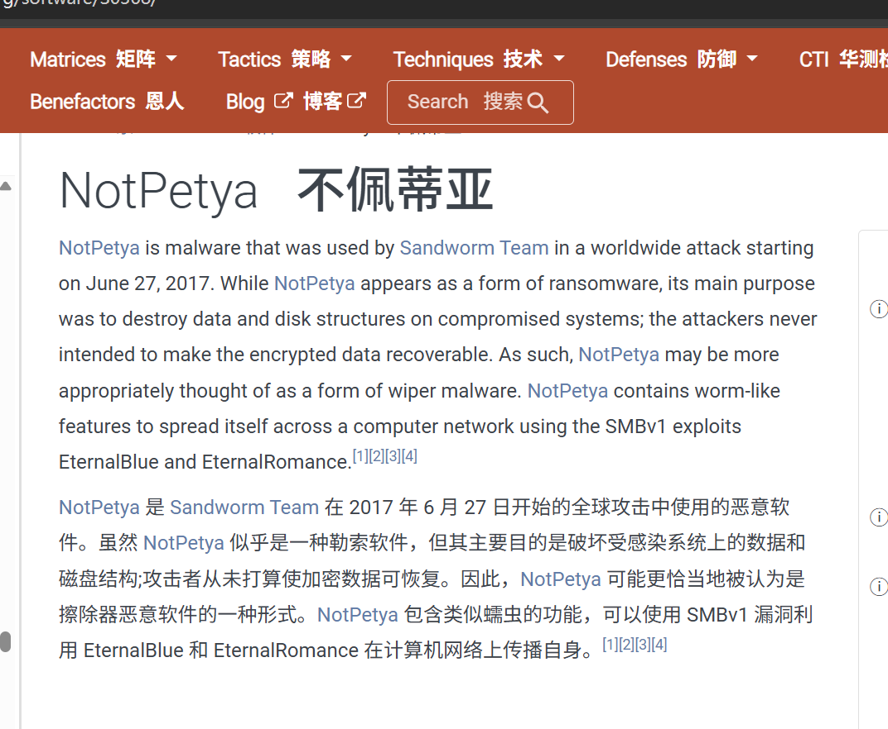

答案：NotPetya

## task11
问题 10 中的恶意软件用于在世界各地传播的漏洞的 Microsoft 安全公告 ID 是什么？

上题我们看到了smbv1漏洞，那一眼永恒之蓝

答案：MS17-010

## task12
该组织用于针对调制解调器的恶意软件/工具的名称是什么？

同上方法一样可以找到

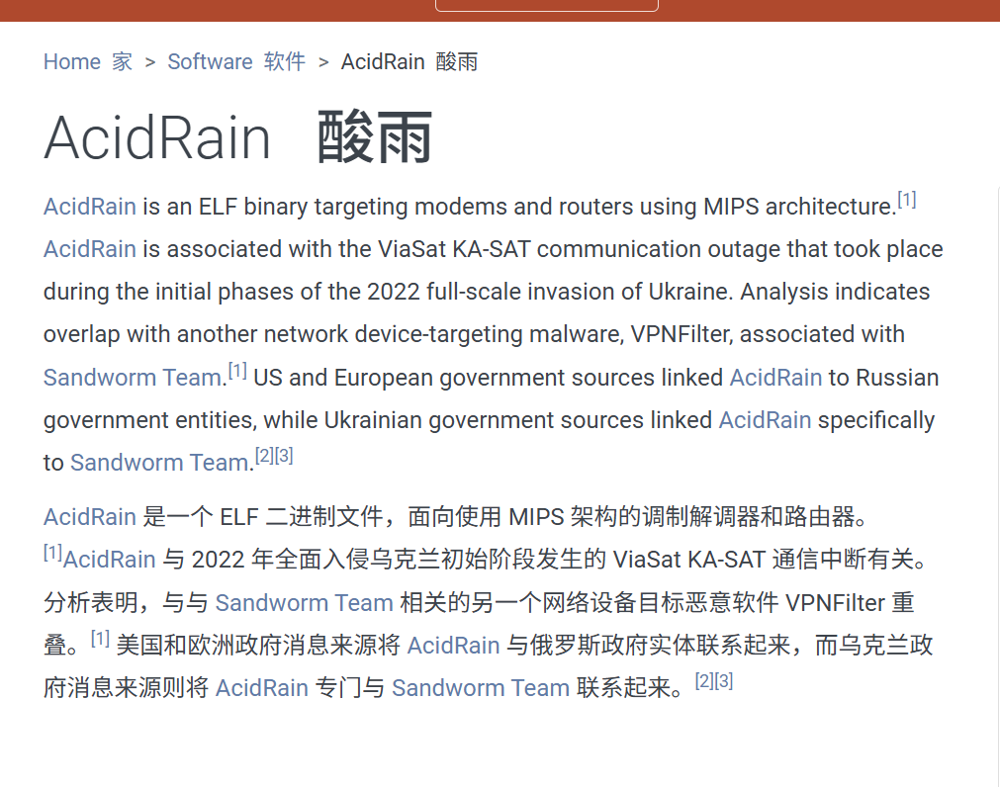

答案：AcidRain

## task13
威胁行为者还在其基础架构中使用非标准端口，以达到运营安全目的。据报道，Sandworm 团队在哪个端口上建立了用于监听的 SSH 服务器？

枚举ssh能找到

答案：6789

## task14
沙虫小组得到了另一个 APT 小组的协助进行各种行动。已知哪个特定团体与他们合作？

最开始的简介指出了

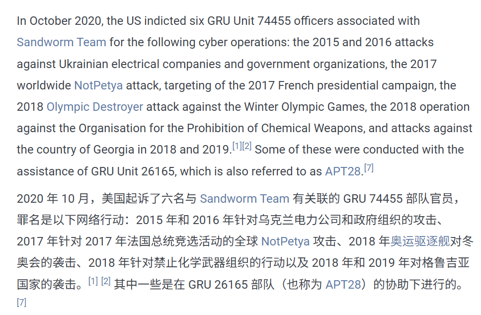

也是俄罗斯那边的，就是试图干扰美国大选那个

答案：APT28