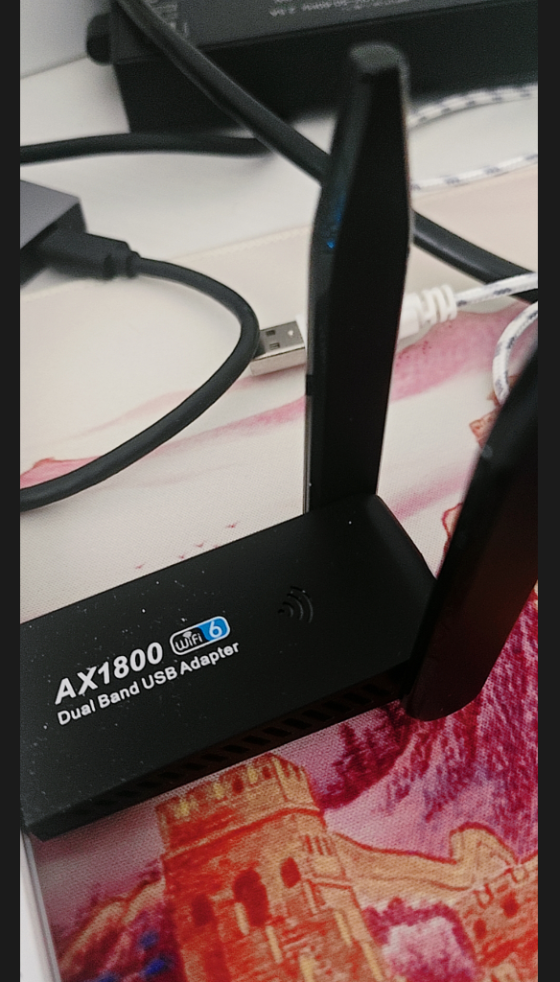

## wifi接口
无线接口是进行 Wi-Fi 渗透测试的关键。毕竟我们的设备就是通过它们来发送和接收数据的。在选购合适的无线接口时，有很多方面需要考虑。如果选了性能太弱的接口，在渗透测试时可能抓不到任何数据。这一部分就是简单研究一下我买的这个小接口



可以使用iw list查看网卡详细信息，如果我们的目标是wpa3但是网卡不支持就没有意义
```zsh
┌──(root㉿kali)-[~]
└─# iw list   
Wiphy phy1
        wiphy index: 1
        max # scan SSIDs: 4
        max scan IEs length: 482 bytes
        max # sched scan SSIDs: 10
        max # match sets: 16
        Retry short limit: 7
        Retry long limit: 4
        Coverage class: 0 (up to 0m)
        Device supports AP-side u-APSD.
        Device supports T-DLS.
        Supported Ciphers:
                * WEP40 (00-0f-ac:1)
                * WEP104 (00-0f-ac:5)
                * TKIP (00-0f-ac:2)
                * CCMP-128 (00-0f-ac:4)
                * CCMP-256 (00-0f-ac:10)
                * GCMP-128 (00-0f-ac:8)
                * GCMP-256 (00-0f-ac:9)
                * CMAC (00-0f-ac:6)
                * CMAC-256 (00-0f-ac:13)
                * GMAC-128 (00-0f-ac:11)
                * GMAC-256 (00-0f-ac:12)
        Available Antennas: TX 0x3 RX 0x3
        Configured Antennas: TX 0x3 RX 0x3
        Supported interface modes:
                 * managed
                 * AP
                 * AP/VLAN
                 * monitor
                 * P2P-client
                 * P2P-GO
        Band 1:
                Capabilities: 0x9ff
                        RX LDPC
                        HT20/HT40
                        SM Power Save disabled
                        RX Greenfield
                        RX HT20 SGI
                        RX HT40 SGI
                        TX STBC
                        RX STBC 1-stream
                        Max AMSDU length: 7935 bytes
                        No DSSS/CCK HT40

```
我省略了一部分，但是上面的信息也差不多了，其支持wpa3协议以及监听模式等
## 接口强度
大部分的wifi渗透都属于近源渗透，所以如果一张卡的输出太低就会导致我们的攻击范围缩小，所以一张卡的强度决定了我们可以再更远更大的范围运行

可以利用iwconfig直接查看我们网卡的信息
```zsh
                                                                                                         
┌──(root㉿kali)-[~]
└─# iwconfig
lo        no wireless extensions.

eth0      no wireless extensions.

wlan0     IEEE 802.11  ESSID:off/any  
          Mode:Managed  Access Point: Not-Associated   Tx-Power=3 dBm   
          Retry short limit:7   RTS thr:off   Fragment thr:off
          Encryption key:off
          Power Management:on

```
可以看到我这张卡的输出是3dBm，这是一个非常小的数字，如果一般家用网卡像是“手电筒”，可以照亮一个房间或整栋楼，我这个 3 dBm 的网卡就像一支“蜡烛”，只能照亮你脚下的几米范围。只够自己测试使用

当然，如果你的卡超过20dbm但是还是只显示20dbm的话，就是因为地区锁频率了,修改一下即可
```zsh
sudo ifconfig wlan0 down
sudo iwconfig wlan0 txpower 30
sudo ifconfig wlan0 up
```
## 改变接口的频道和频率
我们可以利用以下命令查看当前可达通道
```zsh
┌──(root㉿kali)-[~]
└─# iwlist wlan0 channel
wlan0     32 channels in total; available frequencies :
          Channel 01 : 2.412 GHz
          Channel 02 : 2.417 GHz
          Channel 03 : 2.422 GHz
          Channel 04 : 2.427 GHz
          Channel 05 : 2.432 GHz
          Channel 06 : 2.437 GHz
          Channel 07 : 2.442 GHz
          Channel 08 : 2.447 GHz
          Channel 09 : 2.452 GHz
          Channel 10 : 2.457 GHz
          Channel 11 : 2.462 GHz
          Channel 12 : 2.467 GHz
          Channel 13 : 2.472 GHz
          Channel 14 : 2.484 GHz
          Channel 36 : 5.18 GHz
          Channel 40 : 5.2 GHz
          Channel 44 : 5.22 GHz
          Channel 48 : 5.24 GHz
          Channel 52 : 5.26 GHz
          Channel 56 : 5.28 GHz
          Channel 60 : 5.3 GHz
          Channel 64 : 5.32 GHz
          Channel 100 : 5.5 GHz
          Channel 104 : 5.52 GHz
          Channel 108 : 5.54 GHz
          Channel 112 : 5.56 GHz
          Channel 116 : 5.58 GHz
          Channel 120 : 5.6 GHz
          Channel 124 : 5.62 GHz
          Channel 128 : 5.64 GHz
          Channel 132 : 5.66 GHz
```
可以看到我的卡虽然强度不高，但是频段支持的比较多，频道（Channel）和频率（Frequency）在 Wi-Fi 中是紧密相关的

频率是无线电波的物理属性，表示wifi信号在某个频率振荡，而信道是wifi协定中的逻辑编号，用来管理频率，其实也没必要区分，它们俩就是绑定的关系

人们更喜欢记编号而不是小数点的赫兹

我们可以通过以下命令调整wifi应用的信道或者频率，这样能使我们的目标缩减大部分
```zsh
sudo ifconfig wlan0 down
sudo iwconfig wlan0 channel 64 #调整信道到64
#或者在这一步调整频率，效果都是一样的
sudo iwconfig wlan0 freq "5.52G" #调整频率为5.52G
sudo ifconfig wlan0 up
```
当调整完毕后，我们用如下命令查看
```zsh
┌──(root㉿kali)-[~]
└─# sudo ifconfig wlan0 down 
                                                                                                         
┌──(root㉿kali)-[~]
└─# sudo iwconfig wlan0 channel 64  
                                                                                                         
┌──(root㉿kali)-[~]
└─# sudo ifconfig wlan0 up         
                                                                                                         
┌──(root㉿kali)-[~]
└─# iwlist wlan0 frequency | grep Current       
          Current Frequency:5.32 GHz (Channel 64)
                                                                                                         
```
想要取消锁定只需要调会自动即可
```zsh
sudo iwconfig wlan0 channel auto
```
## 接口模式
网卡接口允许不同的模式，以便进行不同的工作方式

### 托管模式(Managed)
最常见的形态，允许我们连接ap点进行无线连接
```zsh
sudo ifconfig wlan0 down
sudo iwconfig wlan0 mode managed
sudo ifconfig wlan0 up
```
### 临时模式（Ad-hoc）
一般用于去中心化的连接，也就是点对点的连接，用于住宅内部自设系统

大部分情况下这是两个桥接在一起的接口，所以需要指定桥接对象
```zsh
sudo iwconfig wlan0 mode ad-hoc
sudo iwconfig wlan0 essid wackymaker
```
### 中心模式（master）
这种模式，我们会成为一个ap点，所以不能简单的利用iwconfig进行设置，需要配置所谓的管理守护模式

```zsh
wackymaker@kali[/kali]$ nano open.conf

interface=wlan0
driver=nl80211
ssid=Hello-World
channel=2
hw_mode=g
```
这段配置的意思是用 wlan0 网卡，通过 nl80211 驱动，在 2.4GHz 第 2 信道 上，开一个名为 Hello-World 的 Wi-Fi AP，工作模式是 802.11g（即 2.4G，速率可达 54Mbps）。

可以利用如下命令启动
```zsh
sudo hostapd open.conf
```
### 节点模式（mesh）
节点模式是个有意思的模式，类似于临时模式是一种点对点的模式，但是不一样的是，当一个节点连入另一个节点后会自动的连接此节点连接的其他节点，如果节点 A 和节点 C 之间距离太远，但 A 和 B、B 和 C 能连上，那么数据就会 A → B → C 自动转发。这样 Mesh 网络可以覆盖非常大的区域。

设置节点模式
```zsh
sudo iw dev wlan0 set type mesh
```
### 监听模式（Monitor）
我们wifi渗透测试最常用的节点，用于监听整个无线环境的连接，也能用来抓取连接包
```zsh
sudo ifconfig wlan0 down
sudo iw wlan0 set monitor control
sudo ifconfig wlan0 up
```
今天就学到这里